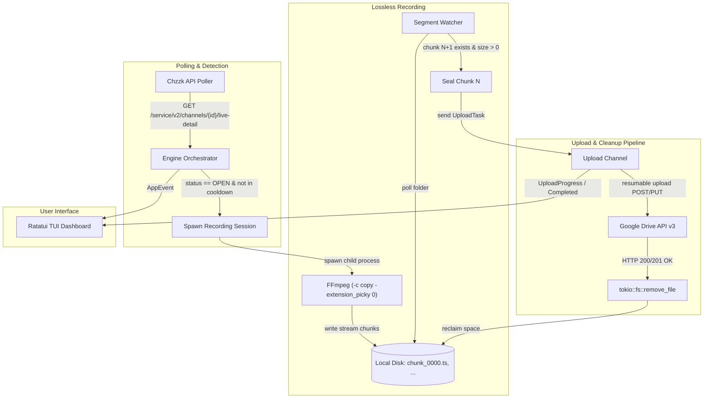

# chzzk-load

A high-performance, standalone Rust application for real-time Naver Chzzk live stream recording and Google Drive syncing, featuring an interactive Terminal User Interface (TUI) powered by [Ratatui](https://github.com/ratatui/ratatui).

`chzzk-load` monitors live broadcasts, losslessly segments streams into MPEG-TS chunks using FFmpeg stream-copy (`-c copy`), concurrently uploads completed chunks to Google Drive via resumable chunked uploads, and immediately deletes local files upon confirmed upload to maintain a strictly bounded disk footprint.

---

## Key Features

- ⚡ **Zero CPU Transcoding Overhead**: Uses FFmpeg stream-copy (`-c copy`) to segment raw HLS video streams into `.ts` chunks with near-zero CPU and memory usage.
- 💾 **Strictly Bounded Disk Footprint**: Only 1–2 video segments reside on disk simultaneously per active stream. Chunks are permanently deleted immediately upon receiving an HTTP 200/201 upload confirmation.
- 🛡️ **N+1 Segment Boundary Safety**: Segment $N$ is only sealed and queued for upload after segment $N+1$ exists on disk with file size $> 0$ bytes (or upon final stream termination), guaranteeing no partial or corrupted chunks are uploaded.
- ☁️ **Resumable Google Drive Sync & Local-Only Fallback**: Uploads chunks using the Google Drive API v3 resumable upload protocol with automated PKCE OAuth2 authorization and token refresh. If Google Drive credentials are not provided, the application runs seamlessly in local-only recording mode.
- 🖥️ **Interactive Ratatui TUI Dashboard**: Real-time status monitoring including monitored channel states, live stream titles, upload progress gauges, transfer speed metrics, disk space reclaimed counters, and a scrollable log console.
- 🔄 **Anti-Race Cache Deduplication**: Protects against Naver Chzzk CDN cache TTL delays (10–30s) by tracking finished broadcast `live_id`s and enforcing a post-recording cooldown to prevent duplicate sessions.
- 🍪 **Authenticated Session Support**: Supports optional Naver cookie credentials (`NID_AUT`, `NID_SES`) to access age-restricted or subscriber-only 1080p live streams.

---

## Prerequisites

- **Rust**: Version 1.85+ (Rust 2024 edition).
- **FFmpeg**: Must be installed and accessible on your system's `PATH`.

To verify FFmpeg is accessible:
```bash
ffmpeg -version
```

---

## Quick Start

### 1. Build from Source

Clone the repository and build the release binary:

```bash
git clone https://github.com/ghfhffh12345/chzzk-load.git
cd chzzk-load
cargo build --release
```

The compiled standalone executable will be located at `target/release/chzzk-load` (or `target/release/chzzk-load.exe` on Windows).

### 2. Run

```bash
# Run with default settings (automatically creates settings.json if missing)
./target/release/chzzk-load

# Or specify a custom configuration file path
./target/release/chzzk-load --config /path/to/my-settings.json
```

On first startup, if `settings.json` is not present, `chzzk-load` automatically generates a default template in the executable's directory.

---

## Configuration (`settings.json`)

The application is configured using a portable JSON file. Paths can be relative to the executable or absolute.

```json
{
  "general": {
    "chunk_duration_seconds": 600,
    "poll_interval_seconds": 20,
    "stream_cooldown_seconds": 60,
    "recordings_dir": "recordings",
    "min_free_disk_gb": 2.0
  },
  "google_drive": {
    "credentials_path": "credentials.json",
    "token_path": "token.json",
    "root_folder_name": "Chzzk_Recordings"
  },
  "chzzk": {
    "nid_aut": "",
    "nid_ses": ""
  },
  "channels": [
    {
      "id": "4c3b44869c9b1399723ec28ec236f736",
      "name": "SampleStreamer"
    }
  ]
}
```

### Configuration Parameters

| Section | Parameter | Default | Description |
| :--- | :--- | :--- | :--- |
| `general` | `chunk_duration_seconds` | `600` (10m) | Duration in seconds for each MPEG-TS chunk. |
| `general` | `poll_interval_seconds` | `20` | Interval in seconds between live broadcast status checks. |
| `general` | `stream_cooldown_seconds` | `60` | Post-recording cooldown period in seconds to prevent duplicate sessions from CDN caching. |
| `general` | `recordings_dir` | `"recordings"` | Local directory where temporary chunks are saved. |
| `general` | `min_free_disk_gb` | `2.0` | Minimum free disk space required to record. |
| `google_drive` | `credentials_path` | `"credentials.json"` | Path to Google OAuth2 Client ID credentials JSON file. |
| `google_drive` | `token_path` | `"token.json"` | Path where authenticated Google OAuth2 tokens are stored. |
| `google_drive` | `root_folder_name` | `"Chzzk_Recordings"` | Name of the root folder created in Google Drive. |
| `chzzk` | `nid_aut` | `""` | Optional Naver session cookie (`NID_AUT`) for adult/subscriber streams. |
| `chzzk` | `nid_ses` | `""` | Optional Naver session cookie (`NID_SES`) for adult/subscriber streams. |
| `channels` | `id` | - | 32-character Chzzk channel ID (from channel URL). |
| `channels` | `name` | - | Human-readable channel display name. |

---

## Google Drive Setup

`chzzk-load` uploads chunks directly to Google Drive via resumable upload. If you do not configure Google Drive, `chzzk-load` will automatically run in **local-only recording mode** and save `.ts` files to your `recordings_dir`.

### Enabling Google Drive Sync:
1. Navigate to the [Google Cloud Console](https://console.cloud.google.com/).
2. Create a new project and enable the **Google Drive API**.
3. Configure the **OAuth Consent Screen** (User Type: External, add your Google account as a Test User if in testing mode).
4. Go to **Credentials** $\to$ **Create Credentials** $\to$ **OAuth Client ID**.
5. Select **Desktop App** as the application type.
6. Download the generated client secrets JSON and save it as `credentials.json` next to the `chzzk-load` executable (or update `credentials_path` in `settings.json`).
7. Start `chzzk-load`. A browser window will automatically open asking for authorization.
8. Approve access. The application will receive the authorization code on a local loopback server and store `token.json` for subsequent automated runs (with automatic token refresh).

---

## TUI Keybindings

When `chzzk-load` is running, you can navigate and control the dashboard with the following keyboard shortcuts:

| Key | Action |
| :--- | :--- |
| `q` | **Quit**: Initiates graceful shutdown (terminates active FFmpeg processes and flushes pending uploads). |
| `r` | **Refresh**: Immediately triggers a manual channel status check. |
| `↑` / `k` | **Navigate Up**: Select previous channel in the channels list. |
| `↓` / `j` | **Navigate Down**: Select next channel in the channels list. |
| `PageUp` | **Scroll Logs Up**: Scroll up log history by 5 lines. |
| `PageDown` | **Scroll Logs Down**: Scroll down log history by 5 lines. |
| `Home` | **Scroll Logs to Top**: Jump to the oldest log messages. |
| `End` | **Scroll Logs to Bottom**: Jump to latest log messages and re-enable auto-tail. |

---

## Architecture Overview



1. **Stream Poller**: Periodically checks the status of monitored channels. When a broadcast goes live, it retrieves the master playlist and selects the highest resolution stream (1080p, 720p).
2. **FFmpeg Segmenter**: Runs as an isolated child process with piped stderr and `-extension_picky 0` (handling query parameters on CDN segments). It segments the live stream into `.ts` files using stream-copy (`-c copy`) without CPU transcoding.
3. **N+1 Segment Watcher**: Ensures only completed chunks are uploaded. Chunk $N$ is only queued for upload after chunk $N+1$ exists and has non-zero size, preventing partial uploads.
4. **Upload Pipeline**: Streams chunk bytes via Google Drive's resumable upload protocol.
5. **Immediate Cleanup**: As soon as Google Drive confirms receipt (HTTP 200/201), the local file is removed, strictly bounding local disk usage to 1–2 segments per stream.
6. **TUI Interface**: Renders channel statuses, upload progress bar, transfer speeds, and diagnostic logs into an interactive raw terminal interface.

---

## CLI Options

```bash
Real-time Chzzk stream recording and Google Drive syncing

Usage: chzzk-load [OPTIONS]

Options:
  -c, --config <CONFIG>  Path to dedicated settings.json file
  -h, --help             Print help
  -V, --version          Print version
```

---

## License

This project is licensed under the Apache License 2.0 - see the [LICENSE](LICENSE) file for details.
