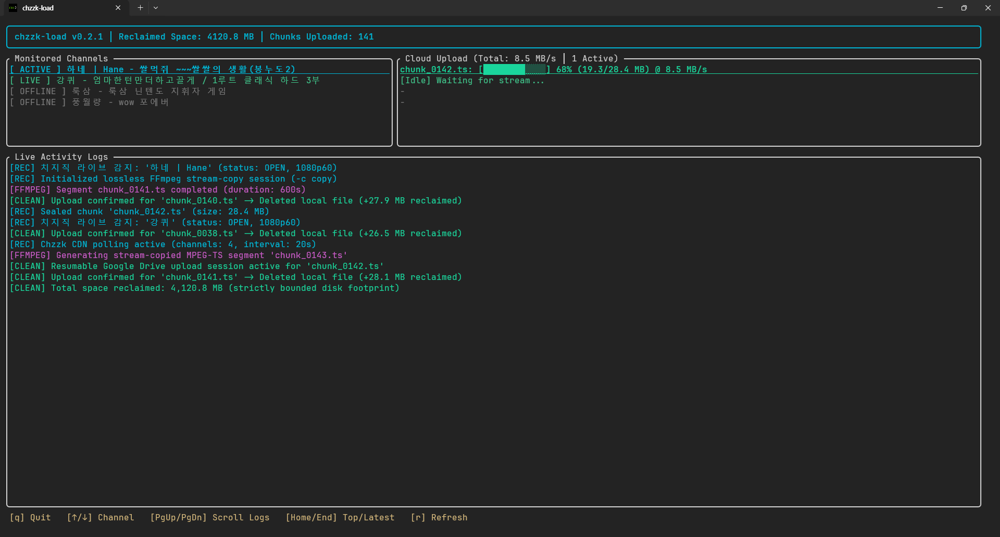

# chzzk-load

**English** | [한국어](README.ko.md)

[](https://www.npmjs.com/package/chzzk-load)
[](https://github.com/ghfhffh12345/chzzk-load/releases)
[](https://github.com/ghfhffh12345/chzzk-load/actions/workflows/ci.yml)
[](LICENSE)

A high-performance, standalone tool for automated Naver Chzzk live stream recording, real-time live chat archiving, and Google Drive syncing, featuring an interactive Terminal User Interface (TUI) powered by [Ratatui](https://github.com/ratatui/ratatui).

`chzzk-load` monitors live broadcasts, losslessly segments video streams into MPEG-TS chunks via FFmpeg stream-copy (`-c copy`), concurrently archives live chat via WebSocket into structured JSON Lines (`chat.jsonl`), concurrently uploads completed chunks and logs to Google Drive, and immediately deletes local files upon confirmed upload to maintain a strictly bounded disk footprint.



---

## Key Features

- ⚡ **Lossless Stream-Copy & Clean EOF (`-c copy`)**: Segments live HLS video streams into `.ts` chunks with zero CPU transcoding overhead. Omits reconnect flags to eliminate infinite HLS manifest EOF retry loops upon natural stream completion.
- 🌐 **Direct CDN Stream Extraction (P2P/Grid Bypass)**: Automatically decodes base64-encoded `cdn_url` parameters from Chzzk `p2pPath` playlists, pulling direct 1080p/720p CDN HLS streams without requiring P2P or grid software.
- 💬 **Real-Time Live Chat Recording (`chat.jsonl`)**: Simultaneously captures live chat via WebSocket into structured JSON Lines format, preserving timestamps, user nicknames, badges, donations/cheeses, and message text.
- 💽 **Flash-Friendly Batched I/O (SBC Optimized)**: Minimizes write cycles to protect microSD card and flash storage longevity on Single Board Computers (Raspberry Pi, ARM64) using in-memory byte buffering with dual-trigger flushing (500 messages / 64 KB capacity, or periodic timer interval).
- 🏷️ **Dynamic Title Tracking & Folder Sync**: Detects stream title changes during broadcasts, records them to `title_history.txt`, and automatically updates Google Drive folder names in real-time.
- 💾 **Strictly Bounded Disk Footprint**: Only 1–2 video segments reside on disk simultaneously per active stream. Chunks and completed chat logs are permanently deleted immediately upon verified cloud upload.
- 🛡️ **N+1 Segment Boundary Safety**: Chunk $N$ is sealed and uploaded only when chunk $N+1$ exists on disk with size $> 0$, preventing partial or corrupted uploads.
- ☁️ **Resilient Google Drive Sync & Local Fallback**: Direct cloud upload via Google Drive API v3 with automatic PKCE OAuth2 authorization, root folder caching, and exponential backoff retries (HTTP 429 & 5xx). Runs in local-only recording mode if Google Drive credentials are omitted.
- 🔀 **Intra-Channel FIFO Serialization & Multi-Stream Concurrency**: Guarantees segments belonging to the same stream upload strictly in sequential order while uploading across different channels concurrently (up to `upload_concurrency`, default: 3).
- 🖥️ **Event-Driven Terminal Dashboard**: Powered by `crossterm::event::EventStream` with zero-allocation rendering, real-time channel states, live stream titles, chat message counters, upload progress gauges, transfer speed metrics, header statistics (active recordings, total duration, archived size), collapsible activity logs (`l` key), and native Windows UTF-8 console support.
- 🔄 **Anti-Race Cache Protection**: Enforces post-recording cooldown and tracks broadcast session IDs to prevent duplicate recording triggers caused by CDN cache TTL delays.

---

## Prerequisites

- **FFmpeg**: Must be installed and accessible on your system's `PATH` (or configured via the `CHZZK_LOAD_FFMPEG_BIN` environment variable).

```bash
ffmpeg -version
```

---

## Installation & Quick Start

Install globally via npm:

```bash
npm install -g chzzk-load
```

Start the application:

```bash
# Run with default settings (automatically creates settings.json if missing)
chzzk-load

# Or specify a custom configuration file
chzzk-load --config /path/to/my-settings.json
```

On first startup, `chzzk-load` generates a default `settings.json` template in the current working directory if one does not exist.

---

## Configuration (`settings.json`)

```json
{
  "general": {
    "chunk_duration_seconds": 600,
    "poll_interval_seconds": 20,
    "stream_cooldown_seconds": 60,
    "recordings_dir": "recordings",
    "min_free_disk_gb": 2.0,
    "record_chat": true,
    "chat_flush_interval_seconds": 30
  },
  "google_drive": {
    "credentials_path": "credentials.json",
    "token_path": "token.json",
    "root_folder_name": "Chzzk_Recordings",
    "upload_concurrency": 3
  },
  "chzzk": {
    "nid_aut": "",
    "nid_ses": ""
  },
  "channels": [
    {
      "id": "1a1dd9ce56fb61a37ffb6f69f6d5b978",
      "name": "강퀴"
    }
  ]
}
```

### Key Settings

| Field | Default | Description |
| :--- | :--- | :--- |
| `general.chunk_duration_seconds` | `600` (10m) | Duration in seconds for each video chunk. |
| `general.poll_interval_seconds` | `20` | Interval in seconds between live broadcast status checks. |
| `general.stream_cooldown_seconds` | `60` | Post-stream cooldown to avoid duplicate sessions from CDN caching. |
| `general.recordings_dir` | `"recordings"` | Local folder for temporary video segments and chat logs. |
| `general.min_free_disk_gb` | `2.0` | Minimum required free disk space in GB to continue recording. |
| `general.record_chat` | `true` | Enable concurrent real-time live chat recording into `chat.jsonl`. |
| `general.chat_flush_interval_seconds` | `30` | Periodic timer interval in seconds to flush buffered chat messages to disk. |
| `google_drive.credentials_path` | `"credentials.json"` | Path to Google OAuth2 Desktop client secrets file. |
| `google_drive.token_path` | `"token.json"` | Path to saved OAuth2 authorization tokens file. |
| `google_drive.root_folder_name` | `"Chzzk_Recordings"` | Destination folder name created in Google Drive. |
| `google_drive.upload_concurrency` | `3` | Maximum number of concurrent channel upload streams (intra-channel uploads remain strictly serialized). |
| `chzzk.nid_aut` / `nid_ses` | `""` | Optional Naver session cookies for adult/subscriber-only streams. |
| `channels` | - | List of monitored Chzzk channels (`id` from channel URL, `name` for display). |

### Recommended Configuration for SBCs (Raspberry Pi, etc.)

For Single Board Computers (such as a Raspberry Pi or ARM64 board running Linux from a microSD card), it is strongly recommended to set `recordings_dir` to a RAM disk (e.g. `/dev/shm/chzzk-load`), shorten `chunk_duration_seconds` to `120`, and limit `upload_concurrency` to `2`.

Because `chzzk-load` maintains only 1–2 video segments locally and deletes them immediately upon confirmed cloud upload, using `/dev/shm` buffers temporary chunks in memory and uploads them directly to Google Drive, completely eliminating flash storage wear and protecting microSD card longevity:

```json
{
  "general": {
    "chunk_duration_seconds": 120,
    "poll_interval_seconds": 20,
    "stream_cooldown_seconds": 0,
    "recordings_dir": "/dev/shm/chzzk-load",
    "min_free_disk_gb": 2.0,
    "record_chat": true,
    "chat_flush_interval_seconds": 30
  },
  "google_drive": {
    "credentials_path": "credentials.json",
    "token_path": "token.json",
    "root_folder_name": "Chzzk_Recordings",
    "upload_concurrency": 2
  },
  "chzzk": {
    "nid_aut": "",
    "nid_ses": ""
  },
  "channels": [
    {
      "id": "1a1dd9ce56fb61a37ffb6f69f6d5b978",
      "name": "강퀴"
    }
  ]
}
```

- **`recordings_dir: "/dev/shm/chzzk-load"`**: Points to Linux shared memory (RAM disk / tmpfs). Video chunks and chat logs are buffered in RAM and deleted immediately upon verified upload, resulting in zero disk writes to your microSD card.
- **`chunk_duration_seconds: 120`**: Shorter 2-minute segments keep in-memory chunk sizes small (~50–100 MB at 1080p60), safely fitting within limited SBC RAM.
- **`stream_cooldown_seconds: 0`**: Bypasses extra cooldown wait times between sessions.
- **`upload_concurrency: 2`**: Bounded upload concurrency prevents network and CPU contention on resource-constrained devices.
- **`chat_flush_interval_seconds: 30`**: Batches real-time chat messages in memory and flushes periodically, reducing I/O operations.

---

## Environment Variables

| Variable | Description |
| :--- | :--- |
| `CHZZK_LOAD_FFMPEG_BIN` | Custom path to the FFmpeg executable (defaults to `ffmpeg` on `PATH`). |
| `CHZZK_LOAD_BIN` | Path override for the native `chzzk-load` binary when running via the npm launcher. |

---

## Google Drive Setup

If Google Drive credentials are not provided, `chzzk-load` automatically runs in **local-only recording mode** and preserves `.ts` files and `chat.jsonl` in `recordings_dir`.

To enable automatic Google Drive upload:
1. In the [Google Cloud Console](https://console.cloud.google.com/), create a project and enable the **Google Drive API**.
2. Under **Credentials** $\to$ **Create Credentials** $\to$ **OAuth Client ID**, select **Desktop App**.
3. Download the client secrets JSON, rename it to `credentials.json`, and place it in the same directory as `settings.json`.
4. Run `chzzk-load`. A browser window will open for one-time OAuth2 authorization. Tokens will be automatically saved to `token.json` and refreshed in future runs.

---

## Keyboard Shortcuts

| Key | Action |
| :--- | :--- |
| `q` | **Quit**: Initiates graceful shutdown (stops active recordings, flushes chat buffer, and completes pending uploads). Press `q` or `Ctrl+C` again to force exit immediately. |
| `l` | **Toggle Logs**: Show or hide the activity log section (expands channels and cloud upload views when hidden). |
| `r` | **Refresh**: Immediately polls monitored channels. |
| `↑` / `k` | **Scroll Up**: Scroll visible channels and cloud uploads upward. |
| `↓` / `j` | **Scroll Down**: Scroll visible channels and cloud uploads downward. |
| `PageUp` / `PageDown` | **Scroll Logs**: Move activity logs up/down by 5 lines. |
| `Home` / `End` | **Log Navigation**: Jump to top (oldest) or bottom (latest, re-enables auto-tail). |

---

## License

Distributed under the Apache License 2.0. See [LICENSE](LICENSE) for details.
