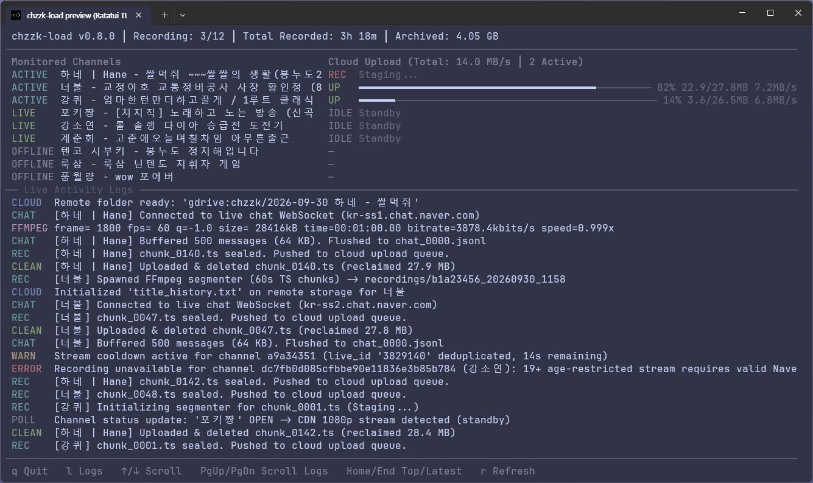

# chzzk-load

**English** | [한국어](README.ko.md)

[](https://www.npmjs.com/package/chzzk-load)
[](https://github.com/ghfhffh12345/chzzk-load/releases)
[](https://github.com/ghfhffh12345/chzzk-load/actions/workflows/ci.yml)
[](LICENSE)

A high-performance, standalone tool for automated Naver Chzzk live stream recording, real-time live chat archiving, and cloud storage syncing (via [rclone](https://rclone.org/)), featuring an interactive Terminal User Interface (TUI) powered by [Ratatui](https://github.com/ratatui/ratatui).

`chzzk-load` monitors live broadcasts, losslessly segments video streams into MPEG-TS chunks via FFmpeg stream-copy (`-c copy`), concurrently archives live chat via WebSocket into structured JSON Lines (`chat_%04d.jsonl`), concurrently uploads completed chunks and logs to cloud storage via rclone (or keeps them locally in local-only mode), and immediately deletes local files upon confirmed upload to maintain a strictly bounded disk footprint.



---

## Key Features

- ⚡ **Lossless Stream-Copy & Clean EOF (`-c copy`)**: Segments live HLS video streams into `.ts` chunks with zero CPU transcoding overhead. Omits reconnect flags to eliminate infinite HLS manifest EOF retry loops upon natural stream completion.
- 🌐 **Direct CDN Stream Extraction (P2P/Grid Bypass)**: Automatically decodes base64-encoded `cdn_url` parameters from Chzzk `p2pPath` playlists, pulling direct 1080p/720p CDN HLS streams without requiring P2P or grid software.
- 💬 **Real-Time Live Chat Recording (`chat_%04d.jsonl`)**: Simultaneously captures live chat via WebSocket into structured JSON Lines format segmented into time-aligned chunks, preserving timestamps, user nicknames, badges, donations/cheeses, and message text.
- 💽 **Flash-Friendly Batched I/O (SBC Optimized)**: Minimizes write cycles to protect microSD card and flash storage longevity on Single Board Computers (Raspberry Pi, ARM64) using in-memory byte buffering with dual-trigger flushing (500 messages / 64 KB capacity, or periodic timer interval).
- 📊 **Stream Metadata Event Tracking (`metadata.jsonl`)**: Tracks all broadcast state transitions (title, category, tags, access tier, watch parties, policies, chat rules) with millisecond-accurate video synchronization, uploaded to cloud storage in real time.
- 💾 **Strictly Bounded Disk Footprint**: Only 1–2 video segments and at most 1 chat chunk reside on disk simultaneously per active stream. Chunks are permanently deleted immediately upon verified cloud upload.
- 🛡️ **N+1 Segment Boundary Safety**: Chunk $N$ is sealed and uploaded only when chunk $N+1$ exists on disk with size $> 0$, preventing partial or corrupted uploads.
- ☁️ **Universal Cloud Storage Sync via Rclone**: Seamless cloud synchronization powered by [rclone](https://rclone.org/), supporting 70+ storage providers including Google Drive, OneDrive, Amazon S3, Dropbox, WebDAV, SFTP, and local paths. Runs in **local-only recording mode** when cloud sync is disabled (`remote_path: ""`).
- 🔀 **Intra-Channel FIFO Serialization & Multi-Stream Concurrency**: Guarantees segments belonging to the same stream upload strictly in sequential order while uploading across different channels concurrently (up to `upload_concurrency`, default: 3).
- 🖥️ **Event-Driven Terminal Dashboard**: Powered by `crossterm::event::EventStream` with zero-allocation rendering, real-time channel states, live stream titles, chat message counters, upload progress gauges, transfer speed metrics, header statistics (active recordings, total duration, archived size), collapsible activity logs (`l` key), and native Windows UTF-8 console support.
- 🔄 **Anti-Race Cache Protection**: Enforces post-recording cooldown and tracks broadcast session IDs to prevent duplicate recording triggers caused by CDN cache TTL delays.

---

## Prerequisites

- **FFmpeg**: Must be installed and accessible on your system's `PATH` (or configured via the `CHZZK_LOAD_FFMPEG_BIN` environment variable).
- **Rclone**: (Optional for local-only mode, required for cloud upload) Must be installed and accessible on your system's `PATH` (or configured via `settings.toml` `rclone.rclone_bin` or the `CHZZK_LOAD_RCLONE_BIN` environment variable).

```bash
ffmpeg -version
rclone version
```

---

## Installation & Quick Start

Install globally via npm:

```bash
npm install -g chzzk-load
```

Start the application:

```bash
# Run with default settings (automatically creates settings.toml if missing)
chzzk-load

# Or specify a custom configuration file
chzzk-load --config /path/to/my-settings.toml

# Or bypass remote connection check at startup
chzzk-load --skip-rclone-check
```

On first startup, `chzzk-load` generates a default `settings.toml` template in the current working directory if one does not exist.

---

## Configuration (`settings.toml`)

```toml
# chzzk-load configuration

[general]
chunk_duration_seconds = 600
poll_interval_seconds = 20
stream_cooldown_seconds = 60
recordings_dir = "recordings"
min_free_disk_gb = 2.0
record_chat = true
chat_flush_interval_seconds = 30

[rclone]
remote_path = "remote:chzzk"
upload_concurrency = 3
rclone_bin = "rclone"
skip_connection_check = false
extra_args = []

[chzzk]
nid_aut = ""
nid_ses = ""

# Channels can be defined with an optional custom alias:
[[channels]]
id = "4c3b44869c9b1399723ec28ec236f736"
alias = "SampleStreamer"

# Or using shorthand string syntax (official channel name is resolved automatically):
# channels = ["4c3b44869c9b1399723ec28ec236f736"]
```

### Key Settings

| Field | Default | Description |
| :--- | :--- | :--- |
| `general.chunk_duration_seconds` | `600` (10m) | Duration in seconds for each video chunk. |
| `general.poll_interval_seconds` | `20` | Interval in seconds between live broadcast status checks. |
| `general.stream_cooldown_seconds` | `60` | Post-stream cooldown to avoid duplicate sessions from CDN caching. |
| `general.recordings_dir` | `"recordings"` | Local folder for temporary video segments and chat logs. |
| `general.min_free_disk_gb` | `2.0` | Minimum required free disk space in GB to continue recording. |
| `general.record_chat` | `true` | Enable concurrent real-time live chat recording into time-aligned `chat_%04d.jsonl` chunks. |
| `general.chat_flush_interval_seconds` | `30` | Periodic timer interval in seconds to flush buffered chat messages to disk. |
| `rclone.remote_path` | `"remote:chzzk"` | Destination remote and folder path in rclone format (`<remote>:<path>`). Set to `""` for **local-only recording mode**. |
| `rclone.upload_concurrency` | `3` | Maximum number of concurrent channel upload streams (intra-channel uploads remain strictly serialized). |
| `rclone.rclone_bin` | `"rclone"` | Path or command name for the rclone executable. |
| `rclone.skip_connection_check` | `false` | Skip remote connection check at startup (runs in background with 10s timeout by default). |
| `rclone.extra_args` | `[]` | Optional extra CLI flags passed to rclone invocations (e.g. `["--drive-chunk-size=64M"]`). |
| `chzzk.nid_aut` / `nid_ses` | `""` | Optional Naver session cookies for adult/subscriber-only streams. |
| `channels` | - | Monitored Chzzk channels. Specify `[[channels]]` with `id` and optional `alias`, or use shorthand string syntax `channels = ["<id>"]` (official streamer name is resolved automatically from the API). |

### Recommended Configuration for SBCs (Raspberry Pi, etc.)

For Single Board Computers (such as a Raspberry Pi or ARM64 board running Linux from a microSD card), it is strongly recommended to set `recordings_dir` to a RAM disk (e.g. `/dev/shm/chzzk-load`), shorten `chunk_duration_seconds` to `120`, and limit `upload_concurrency` to `2`.

Because `chzzk-load` maintains only 1–2 video segments and active chat chunks locally and deletes them immediately upon confirmed cloud upload, using `/dev/shm` buffers temporary chunks in memory and uploads them directly to cloud storage, completely eliminating flash storage wear and protecting microSD card longevity:

```toml
[general]
chunk_duration_seconds = 120
poll_interval_seconds = 20
stream_cooldown_seconds = 0
recordings_dir = "/dev/shm/chzzk-load"
min_free_disk_gb = 2.0
record_chat = true
chat_flush_interval_seconds = 30

[rclone]
remote_path = "remote:chzzk"
upload_concurrency = 2
rclone_bin = "rclone"
extra_args = []

[chzzk]
nid_aut = ""
nid_ses = ""

[[channels]]
id = "4c3b44869c9b1399723ec28ec236f736"
alias = "SampleStreamer"
```

- **`recordings_dir: "/dev/shm/chzzk-load"`**: Points to Linux shared memory (RAM disk / tmpfs). Video chunks and chat logs are buffered in RAM and deleted immediately upon verified upload, resulting in zero disk writes to your microSD card.
- **`chunk_duration_seconds: 120`**: Shorter 2-minute segments keep in-memory chunk sizes small (~50–100 MB at 1080p60), safely fitting within limited SBC RAM.
- **`stream_cooldown_seconds: 0`**: Bypasses extra cooldown wait times between sessions.
- **`upload_concurrency: 2`**: Bounded upload concurrency prevents network and CPU contention on resource-constrained devices.
- **`chat_flush_interval_seconds: 30`**: Batches real-time chat messages in memory and flushes periodically, reducing I/O operations.

---

## Data Formats & File Specifications

Each recording session generates a dedicated directory structured as `[{timestamp}] [{alias}] {streamer_name} - {title}` containing lossless video segments, chunked chat logs, and broadcast metadata events:

```
recordings/
└── [2026-09-30_140000] [StreamerAlias] StreamerName - Live Stream Title/
    ├── chunk_0000.ts          # Video segment (lossless MPEG-TS)
    ├── chunk_0001.ts
    ├── chat_0000.jsonl        # Chat log segment (JSON Lines)
    ├── chat_0001.jsonl
    └── metadata.jsonl         # Broadcast state transitions & sync timeline
```

---

### 1. Live Chat Format (`chat_%04d.jsonl`)

Live chat messages captured via WebSocket are serialized as structured JSON Lines into progressively numbered chunks (`chat_%04d.jsonl`), time-aligned with video segments (`chunk_duration_seconds`).

#### Field Schema

| Field | Type | Description |
| :--- | :--- | :--- |
| `time_ms` | `number` | Unix timestamp in milliseconds when the message was sent on Chzzk. |
| `datetime` | `string` | Local timestamp formatted as `YYYY-MM-DD HH:mm:ss`. |
| `msg_type` | `string` | Message category: `"TEXT"`, `"DONATION"`, `"SUBSCRIPTION"`, `"SYSTEM_MESSAGE"`, or `"TYPE_{code}"`. |
| `nickname` | `string` | Display nickname of the message sender. |
| `user_id_hash` | `string \| null` | Anonymized user ID hash provided by Chzzk API. |
| `content` | `string` | Raw text content of the message. |
| `donation_amount` | `number \| null` | Donated cheese amount (present for `"DONATION"` messages, `null` otherwise). |
| `extras` | `object \| null` | Parsed JSON object containing user badges, subscription tier, emojis, and pay metadata. |
| `raw` | `object` | Complete raw JSON envelope as delivered by the Chzzk WebSocket server. |

#### Example Record (Standard Chat)

```json
{
  "time_ms": 1790757912345,
  "datetime": "2026-09-30 14:05:12",
  "msg_type": "TEXT",
  "nickname": "ChzzkViewer",
  "user_id_hash": "a1b2c3d4e5f6789012345678abcdef01",
  "content": "GG! Great play!",
  "donation_amount": null,
  "extras": {
    "chatType": "STREAMING",
    "emojis": {},
    "osType": "PC",
    "streamingChannelId": "4c3b44869c9b1399723ec28ec236f736",
    "userRoleCode": "common_user"
  },
  "raw": { "cmd": 93101, "bdy": [], "tid": "1" }
}
```

#### Example Record (Donation)

```json
{
  "time_ms": 1790757920123,
  "datetime": "2026-09-30 14:05:20",
  "msg_type": "DONATION",
  "nickname": "CheeseLover",
  "user_id_hash": "b2c3d4e5f6a1789012345678abcdef02",
  "content": "Cheering you on! Here is 1,000 cheese!",
  "donation_amount": 1000,
  "extras": {
    "donationType": "CHAT",
    "payAmount": 1000,
    "payType": "CURRENCY"
  },
  "raw": { "cmd": 93102, "bdy": [], "tid": "2" }
}
```

---

### 2. Stream Metadata & Timeline Format (`metadata.jsonl`)

`metadata.jsonl` tracks all broadcast state transitions across the lifetime of the stream with millisecond-accurate video timeline synchronization (`stream_offset_ms`). It is dual-written locally and updated in real time on cloud storage via `rclone rcat`.

#### Event Types

- **`INITIAL_STATE`**: Written once at stream startup (`stream_offset_ms: 0`), capturing the complete initial broadcast snapshot.
- **`METADATA_CHANGED`**: Emitted whenever any tracked broadcast property changes (e.g. title update, category switch, watch party started, chat rules modified). Contains a `changes` diff alongside the updated `state` snapshot.

#### Envelope Schema

| Field | Type | Description |
| :--- | :--- | :--- |
| `version` | `number` | Schema version (`1`). |
| `event` | `string` | Event discriminator: `"INITIAL_STATE"` or `"METADATA_CHANGED"`. |
| `timestamp` | `string` | UTC timestamp in ISO 8601 format (`YYYY-MM-DDTHH:mm:ssZ`). |
| `time_local` | `string` | Local timestamp formatted as `YYYY-MM-DD HH:mm:ss`. |
| `stream_offset_ms`| `number` | Milliseconds elapsed since the recording session started (`0` at initial start). Syncs directly with video timestamps. |
| `changes` | `object \| null` | Field diff object (`null` for `"INITIAL_STATE"`). Contains `{ "old": ..., "new": ... }` for each changed property. |
| `state` | `object` | Complete snapshot of the broadcast state after the event occurred. |

#### State Snapshot Schema (`state`)

| Field | Type | Description |
| :--- | :--- | :--- |
| `channel_id` | `string` | Monitored Chzzk channel alphanumeric ID. |
| `channel_name` | `string` | Streamer channel display name. |
| `live_title` | `string` | Broadcast title. |
| `live_id` | `number \| null` | Unique numeric broadcast session ID. |
| `open_date` | `string \| null` | Stream start timestamp from Chzzk API. |
| `close_date` | `string \| null` | Stream end timestamp (populated upon stream completion). |
| `channel_image_url` | `string \| null` | Streamer profile picture CDN URL. |
| `verified_mark` | `boolean` | Whether the streamer has an official verified partner mark. |
| `category_type` | `string \| null` | Broad category classification (`"GAME"`, `"TALK"`, `"SPORTS"`, `"ETC"`, etc.). |
| `live_category` | `string \| null` | Category slug identifier (e.g. `"game"`, `"talk"`). |
| `live_category_value`| `string \| null` | Display category/game title (e.g. `"Valorant"`, `"League of Legends"`). |
| `tags` | `string[]` | List of broadcast tags configured by the streamer. |
| `access_tier` | `string` | Mutually exclusive access gating tier: `"PUBLIC"`, `"ADULT_ONLY"`, `"CHEAT_KEY"`, `"NAVER_PLUS"`, `"CHANNEL_SUBSCRIPTION"`, or `"PAY_PER_VIEW"`. |
| `policies` | `object` | Broadcast access policies: `kr_only_viewing` (`bool`), `clip_active` (`bool`), `time_machine_active` (`bool`). |
| `watch_party` | `object` | Watch party metadata: `is_active` (`bool`), `no` (`number \| null`), `tag` (`string \| null`), `party_type` (`string \| null`), `paid_product_id` (`string \| null`). |
| `chat_rules` | `object` | Chat rules & restrictions: `chat_active` (`bool`), `chat_available_group` (`string \| null`), `chat_available_condition` (`string \| null`), `min_follower_minute` (`number \| null`), `allow_subscriber_in_follower_mode` (`bool`), `chat_slow_mode_sec` (`number \| null`), `chat_emoji_mode` (`bool`), `chat_donation_ranking_exposure` (`bool`). |
| `paid_promotion` | `boolean` | Whether paid sponsorship/advertisement is declared. |
| `drops_campaign_no`| `string \| null` | Identifier of active Drops campaign, if any. |
| `log_power_active` | `boolean` | Whether Chzzk Log Power integration is active. |
| `live_thumbnail_image_url` | `string \| null` | Live preview thumbnail CDN URL. |
| `default_thumbnail_image_url` | `string \| null` | Channel default fallback thumbnail CDN URL. |
| `concurrent_user_count` | `number \| null` | Concurrent live viewer count at the moment of the event. |
| `accumulate_count` | `number \| null` | Cumulative total viewer count at the moment of the event. |

> [!TIP]
> **Change Detection & Anti-Churn**: Fluctuating telemetry counters (`concurrent_user_count`, `accumulate_count`) and CDN thumbnail query token changes are captured in snapshots but **do not trigger** `METADATA_CHANGED` events to prevent write churn.

#### Example Record (`METADATA_CHANGED`)

```json
{
  "version": 1,
  "event": "METADATA_CHANGED",
  "timestamp": "2026-09-30T14:35:10Z",
  "time_local": "2026-09-30 23:35:10",
  "stream_offset_ms": 2110450,
  "changes": {
    "live_title": {
      "old": "Just Chatting and relaxing",
      "new": "Switching to Valorant with viewers!"
    },
    "category_type": {
      "old": "TALK",
      "new": "GAME"
    },
    "live_category_value": {
      "old": "Just Chatting",
      "new": "Valorant"
    }
  },
  "state": {
    "channel_id": "4c3b44869c9b1399723ec28ec236f736",
    "channel_name": "SampleStreamer",
    "channel_image_url": "https://nng-phinf.pstatic.net/...",
    "verified_mark": true,
    "live_title": "Switching to Valorant with viewers!",
    "live_id": 3829140,
    "open_date": "2026-09-30 23:00:00",
    "close_date": null,
    "category_type": "GAME",
    "live_category": "game",
    "live_category_value": "Valorant",
    "tags": ["Valorant", "FPS", "Viewers"],
    "access_tier": "PUBLIC",
    "policies": {
      "kr_only_viewing": false,
      "clip_active": true,
      "time_machine_active": true
    },
    "watch_party": {
      "is_active": false,
      "no": null,
      "tag": null,
      "party_type": null,
      "paid_product_id": null
    },
    "chat_rules": {
      "chat_active": true,
      "chat_available_group": null,
      "chat_available_condition": null,
      "min_follower_minute": null,
      "allow_subscriber_in_follower_mode": false,
      "chat_slow_mode_sec": null,
      "chat_emoji_mode": false,
      "chat_donation_ranking_exposure": true
    },
    "paid_promotion": false,
    "drops_campaign_no": null,
    "log_power_active": false,
    "live_thumbnail_image_url": "https://livecloud-thumb.akamaized.net/...",
    "default_thumbnail_image_url": "https://nng-phinf.pstatic.net/...",
    "concurrent_user_count": 1840,
    "accumulate_count": 8920
  }
}
```

---

## Environment Variables

| Variable | Description |
| :--- | :--- |
| `CHZZK_LOAD_FFMPEG_BIN` | Custom path to the FFmpeg executable (defaults to `ffmpeg` on `PATH`). |
| `CHZZK_LOAD_RCLONE_BIN` | Custom path to the rclone executable (overrides `rclone.rclone_bin` and system `PATH`). |
| `CHZZK_LOAD_BIN` | Path override for the native `chzzk-load` binary when running via the npm launcher. |

---

## Cloud Storage Setup (rclone)

If `remote_path` is left empty (`""`), `chzzk-load` automatically runs in **local-only recording mode** and preserves `.ts` files and `chat_%04d.jsonl` chunks in `recordings_dir`.

To enable automatic cloud storage upload:
1. Install [rclone](https://rclone.org/downloads/) on your system:
   - **Windows**: `winget install Rclone.Rclone` or `choco install rclone`
   - **macOS**: `brew install rclone`
   - **Linux**: `sudo apt install rclone` or `curl https://rclone.org/install.sh | sudo bash`
2. Run `rclone config` in your terminal to configure your desired cloud storage remote (e.g. `gdrive` for Google Drive, `onedrive` for Microsoft OneDrive, `s3` for AWS S3, etc.). Follow the interactive prompts provided by rclone.
3. Test your remote connection:
   ```bash
   rclone lsd gdrive:
   ```
4. Set `remote_path` in `settings.toml` to your target remote and destination folder (e.g. `remote_path = "remote:chzzk"` or `remote_path = "onedrive:Recordings"`).
5. Run `chzzk-load`. The application will verify the rclone remote connection on startup and stream completed segments to your cloud storage.

---

## Keyboard Shortcuts

| Key | Action |
| :--- | :--- |
| `q` | **Quit**: Initiates graceful shutdown (stops active recordings, flushes chat buffer, and completes pending uploads). Press `q` or `Ctrl+C` again to force exit immediately. |
| `l` | **Toggle Logs**: Show or hide the activity log section (expands channels and cloud upload views when hidden). |
| `r` | **Refresh**: Immediately polls monitored channels. |
| `↑` / `k` | **Scroll Up**: Scroll visible channels and cloud uploads upward. |
| `↓` / `j` | **Scroll Down**: Scroll visible channels and cloud uploads downward. |
| `PageUp` / `PageDown` | **Scroll Logs**: Move activity logs up/down by 5 lines. |
| `Home` / `End` | **Log Navigation**: Jump to top (oldest) or bottom (latest, re-enables auto-tail). |

---

## License

Distributed under the Apache License 2.0. See [LICENSE](LICENSE) for details.
