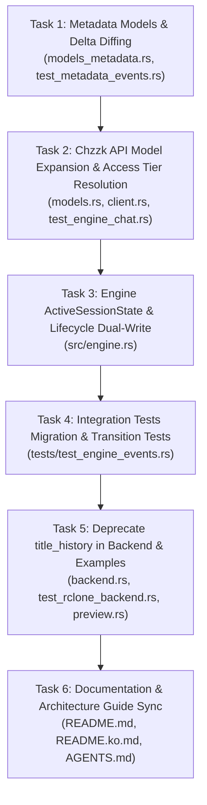

# Stream Metadata Event Tracking (`metadata.jsonl`) Implementation Plan

> **For agentic workers:** REQUIRED SUB-SKILL: Use superpowers:subagent-driven-development (recommended) or superpowers:executing-plans to implement this plan task-by-task. Steps use checkbox (`- [ ]`) syntax for tracking.

**Goal:** Completely replace `title_history.txt` with an extensible, append-only JSON Lines event stream (`metadata.jsonl`) tracking all broadcast state transitions (title, category, tags, access tier, watch parties, policies, chat rules) with millisecond-accurate video timeline synchronization (`stream_offset_ms`).

**Architecture:** 
1. Introduce `models_metadata.rs` providing normalized metadata snapshots (`StreamMetadataState`), delta diffing (`MetadataDelta`), custom resilient deserializers (`deserialize_optional_string_or_number`), and event envelopes (`MetadataEvent`) with millisecond-accurate elapsed offsets (`stream_offset_ms`).
2. Expand `ChannelInfo`, `LiveDetailContent`, and `LiveStreamInfo` to parse all 2026 Chzzk production fields and resolve access tiers (`resolve_access_tier`).
3. Re-architect `ActiveSessionState` in `src/engine.rs` to track `metadata_history: Vec<MetadataEvent>`, `session_start_instant: Instant`, and `current_metadata: StreamMetadataState`.
4. Implement local-and-cloud dual-write in `EngineOrchestrator`:
   - Startup (`spawn_recording_session`): write initial `INITIAL_STATE` locally to `<session_dir>/metadata.jsonl` and upload via `backend.upload_text(&session_folder_name, "metadata.jsonl", &initial_jsonl)`.
   - Polling loop (`poll_channels_once`): detect discrete transitions via `compute_delta`, append `METADATA_CHANGED` locally, and upload updated `metadata.jsonl` via `upload_text`.
   - Shutdown: upload final `metadata.jsonl` state to cloud storage.
5. Completely deprecate and remove `title_history.txt` across all code, tests, examples, and documentation.

**Tech Stack:** Rust 2024 edition, Tokio, Serde / Serde JSON, Chrono, Reqwest.

**Spec Reference:** [`docs/superpowers/specs/2026-09-30-stream-metadata-tracking-design.md`](file:///C:/Users/official/Documents/Code/chzzk-load/docs/superpowers/specs/2026-09-30-stream-metadata-tracking-design.md)

---

## Global Constraints & Invariants

- **Zero C / FFI Dependencies**: Binary must remain 100% pure Rust to preserve static musl cross-compilation with `cargo-zigbuild` on Linux x86_64 and ARM64.
- **Strictly Non-Blocking Scoping**: Never hold `active_sessions` or `active_recordings` mutex locks across asynchronous network requests, backend uploads, or file I/O (`AGENTS.md` invariant).
- **Zero Temporary Disk Files for Cloud Sync**: In-memory JSON Lines string is streamed directly to remote storage via `rclone rcat` (`UploadBackend::upload_text`).
- **Resilient Dual-Write & Local-Only Mode**: When cloud upload is unconfigured (`remote_path: ""`), local `metadata.jsonl` must still be created, appended, and preserved with zero warnings or errors.
- **Telemetry Isolation**: High-frequency telemetry churn (`concurrent_user_count`, `accumulate_count`, thumbnail URLs) must be recorded inside snapshots but must **never** trigger `METADATA_CHANGED` events on their own.
- **Monotonic Sub-Second Timing**: `stream_offset_ms` must be calculated from `session_start_instant.elapsed().as_millis() as u64`, ensuring monotonic non-decreasing timing across all events, with `0` on `INITIAL_STATE`.
- **Complete Deprecation**: No backward compatibility for `title_history.txt`. Delete all struct fields, methods, test assertions, and references.
- **Rust 2024 Edition Conventions**: Avoid `mod.rs`, use inlined string interpolation (`format!("{channel_id}")`), and ensure clean clippy checks (`cargo clippy --all-targets -- -D warnings`).

---

## Review Focus & Critical Decision Points

1. **Intermediate Compilation Preservation**: When `LiveStreamInfo` gains `pub metadata: StreamMetadataState` in Task 2, all test initializers in `tests/test_engine_chat.rs` (5 call sites) and `tests/test_engine_events.rs` (2 call sites) must provide `metadata: StreamMetadataState::default()` to avoid compiler breakage across the repository.
2. **Access Tier Resolution Precedence**: PayPerView > ChannelSubscription > NaverPlus > CheatKey > AdultOnly > Public must be strictly resolved via `resolve_access_tier`.
3. **Union & Dynamic Field Deserialization**: Fields like `drops_campaign_no`, `live_id`, and `watch_party_no` can arrive as numeric literals, string literals, or nulls in Chzzk API payloads and must deserialize into `Option<String>` / `Option<u64>` / `Option<i64>` without panicking.
4. **Cohesive Engine Orchestrator Migration**: In `src/engine.rs`, updating `ActiveSessionState` must be bundled with updating its internal callers (`spawn_recording_session`, `poll_channels_once`, and the internal unit test `test_active_session_state_metadata_jsonl_formatting`) so that `src/engine.rs` compiles cleanly.

---

## Detailed Task Breakdown



---

### Task 1: Metadata Models, Custom Deserializers, and Delta Diffing Engine

**Files:**
- Create: `src/chzzk/models_metadata.rs`
- Modify: `src/chzzk.rs:1-10`
- Test: `tests/test_metadata_events.rs`

**Interfaces:**
- Produces:
  - `StreamAccessTier`: `Public` (default), `AdultOnly`, `CheatKey`, `ChannelSubscription`, `NaverPlus`, `PayPerView`
  - `CategoryType`: `Game`, `Sports`, `Etc`, `Talk`, `Unknown`
  - `WatchPartyState`: `is_active`, `no`, `tag`, `party_type`, `paid_product_id`
  - `BroadcastPolicies`: `kr_only_viewing`, `playable_status`, `blind_type`, `time_machine_active`, `clip_active`, `tv_app_viewing_policy_type`
  - `ChatRulesState`: `chat_active`, `chat_available_group`, `chat_available_condition`, `min_follower_minute`, `allow_subscriber_in_follower_mode`, `chat_slow_mode_sec`, `chat_emoji_mode`, `chat_donation_ranking_exposure`
  - `StreamMetadataState`: normalized snapshot struct deriving `Default, Clone, PartialEq, Eq, Serialize, Deserialize` with `compute_delta(&self, new: &Self) -> Option<MetadataDelta>`
  - `MetadataDelta`: diff struct with `is_empty(&self) -> bool`
  - `MetadataEvent`: JSON line container with `version: u8`, `event: MetadataEventType`, `timestamp`, `time_local`, `stream_offset_ms`, `changes`, `state`
  - `deserialize_optional_string_or_number`: Serde helper for dynamic string/numeric fields

- [x] **Step 1: Write the failing unit tests for metadata models and delta computation**

Create `tests/test_metadata_events.rs`:
```rust
use chzzk_load::chzzk::models_metadata::{
    BroadcastPolicies, CategoryType, ChatRulesState, MetadataDelta, MetadataEvent,
    MetadataEventType, StreamAccessTier, StreamMetadataState, WatchPartyState,
};

fn sample_metadata_state() -> StreamMetadataState {
    StreamMetadataState {
        live_id: Some(21378610),
        open_date: Some("2026-09-30 14:00:00".to_string()),
        close_date: None,
        channel_id: "chan_123".to_string(),
        channel_name: "TestStreamer".to_string(),
        channel_image_url: Some("https://test.com/pfp.png".to_string()),
        verified_mark: true,
        live_title: "Initial Title".to_string(),
        category_type: Some(CategoryType::Talk),
        live_category: Some("talk".to_string()),
        live_category_value: Some("Just Chatting".to_string()),
        tags: vec!["소통".to_string()],
        access_tier: StreamAccessTier::Public,
        policies: BroadcastPolicies {
            kr_only_viewing: false,
            playable_status: Some("PLAYABLE".to_string()),
            blind_type: None,
            time_machine_active: true,
            clip_active: true,
            tv_app_viewing_policy_type: None,
        },
        watch_party: WatchPartyState::default(),
        chat_rules: ChatRulesState {
            chat_active: true,
            chat_available_group: Some("ALL".to_string()),
            chat_available_condition: Some("NONE".to_string()),
            min_follower_minute: Some(0),
            allow_subscriber_in_follower_mode: false,
            chat_slow_mode_sec: Some(0),
            chat_emoji_mode: false,
            chat_donation_ranking_exposure: true,
        },
        paid_promotion: false,
        drops_campaign_no: None,
        log_power_active: false,
        live_thumbnail_image_url: Some("https://test.com/thumb.jpg".to_string()),
        default_thumbnail_image_url: None,
        concurrent_user_count: Some(100),
        accumulate_count: Some(500),
    }
}

#[test]
fn test_metadata_delta_computation_no_change_on_telemetry() {
    let state1 = sample_metadata_state();
    let mut state2 = state1.clone();
    // Changing only telemetry or thumbnails should NOT produce a delta
    state2.concurrent_user_count = Some(200);
    state2.accumulate_count = Some(600);
    state2.live_thumbnail_image_url = Some("https://test.com/thumb2.jpg".to_string());
    state2.default_thumbnail_image_url = Some("https://test.com/default2.jpg".to_string());
    state2.channel_image_url = Some("https://test.com/pfp2.png".to_string());

    assert!(state1.compute_delta(&state2).is_none());
}

#[test]
fn test_metadata_delta_computation_title_and_category_change() {
    let state1 = sample_metadata_state();
    let mut state2 = state1.clone();
    state2.live_title = "New Game Broadcast".to_string();
    state2.category_type = Some(CategoryType::Game);
    state2.live_category_value = Some("Valorant".to_string());

    let delta = state1.compute_delta(&state2).expect("delta must exist");
    assert_eq!(delta.live_title.as_ref().unwrap().old, "Initial Title");
    assert_eq!(delta.live_title.as_ref().unwrap().new, "New Game Broadcast");
    assert_eq!(delta.category_type.as_ref().unwrap().new, Some(CategoryType::Game));
    assert_eq!(delta.live_category_value.as_ref().unwrap().new, Some("Valorant".to_string()));
    assert!(delta.watch_party.is_none());
}

#[test]
fn test_metadata_delta_computation_watch_party_and_drops() {
    let state1 = sample_metadata_state();
    let mut state2 = state1.clone();
    state2.watch_party = WatchPartyState {
        is_active: true,
        no: Some(520),
        tag: Some("2026아시안게임".to_string()),
        party_type: Some("RS".to_string()),
        paid_product_id: None,
    };
    state2.drops_campaign_no = Some("camp_val_99".to_string());
    state2.policies.kr_only_viewing = true;

    let delta = state1.compute_delta(&state2).expect("delta must exist");
    assert_eq!(delta.watch_party.as_ref().unwrap().new.no, Some(520));
    assert_eq!(delta.drops_campaign_no.as_ref().unwrap().new, Some("camp_val_99".to_string()));
    assert!(delta.policies.as_ref().unwrap().new.kr_only_viewing);
}

#[test]
fn test_metadata_jsonl_serialization_roundtrip() {
    let state = sample_metadata_state();
    let event = MetadataEvent {
        version: 1,
        event: MetadataEventType::InitialState,
        timestamp: "2026-09-30T05:00:00Z".to_string(),
        time_local: "2026-09-30 14:00:00".to_string(),
        stream_offset_ms: 0,
        changes: None,
        state,
    };

    let serialized = serde_json::to_string(&event).unwrap();
    let deserialized: MetadataEvent = serde_json::from_str(&serialized).unwrap();
    assert_eq!(deserialized.version, 1);
    assert_eq!(deserialized.event, MetadataEventType::InitialState);
    assert_eq!(deserialized.stream_offset_ms, 0);
    assert_eq!(deserialized.state.channel_name, "TestStreamer");
    assert!(deserialized.changes.is_none());
}

#[test]
fn test_deserialize_optional_string_or_number() {
    #[derive(serde::Deserialize)]
    struct TestContainer {
        #[serde(default, deserialize_with = "chzzk_load::chzzk::models_metadata::deserialize_optional_string_or_number")]
        val: Option<String>,
    }

    let parsed_str: TestContainer = serde_json::from_str(r#"{"val": "campaign_123"}"#).unwrap();
    assert_eq!(parsed_str.val, Some("campaign_123".to_string()));

    let parsed_num: TestContainer = serde_json::from_str(r#"{"val": 98765}"#).unwrap();
    assert_eq!(parsed_num.val, Some("98765".to_string()));

    let parsed_null: TestContainer = serde_json::from_str(r#"{"val": null}"#).unwrap();
    assert_eq!(parsed_null.val, None);

    let parsed_empty: TestContainer = serde_json::from_str(r#"{}"#).unwrap();
    assert_eq!(parsed_empty.val, None);
}
```

- [x] **Step 2: Run test to verify it fails**

Run: `cargo test --test test_metadata_events`
Expected: Compilation failure (`models_metadata` module not found).

- [x] **Step 3: Implement `src/chzzk/models_metadata.rs` and re-export in `src/chzzk.rs`**

Create `src/chzzk/models_metadata.rs`:
```rust
use serde::{Deserialize, Deserializer, Serialize};

/// Mutually exclusive access gating tier required to view the live broadcast.
#[derive(Debug, Clone, Copy, PartialEq, Eq, Serialize, Deserialize, Default)]
#[serde(rename_all = "SCREAMING_SNAKE_CASE")]
pub enum StreamAccessTier {
    #[default]
    Public,
    AdultOnly,
    CheatKey,
    ChannelSubscription,
    NaverPlus,
    PayPerView,
}

/// Broad category grouping, forward-compatible with future additions.
#[derive(Debug, Clone, PartialEq, Eq, Serialize, Deserialize)]
#[serde(rename_all = "SCREAMING_SNAKE_CASE")]
pub enum CategoryType {
    Game,
    Sports,
    Etc,
    Talk,
    #[serde(other)]
    Unknown,
}

/// Official co-streaming and watch-along state.
#[derive(Debug, Clone, Default, PartialEq, Eq, Serialize, Deserialize)]
pub struct WatchPartyState {
    pub is_active: bool,
    #[serde(default, skip_serializing_if = "Option::is_none")]
    pub no: Option<i64>,
    #[serde(default, skip_serializing_if = "Option::is_none")]
    pub tag: Option<String>,
    #[serde(default, skip_serializing_if = "Option::is_none")]
    pub party_type: Option<String>,
    #[serde(default, skip_serializing_if = "Option::is_none")]
    pub paid_product_id: Option<serde_json::Value>,
}

/// Geo-blocking, moderation enforcement, and playback feature flags.
#[derive(Debug, Clone, Default, PartialEq, Eq, Serialize, Deserialize)]
pub struct BroadcastPolicies {
    pub kr_only_viewing: bool,
    #[serde(default, skip_serializing_if = "Option::is_none")]
    pub playable_status: Option<String>,
    #[serde(default, skip_serializing_if = "Option::is_none")]
    pub blind_type: Option<String>,
    pub time_machine_active: bool,
    pub clip_active: bool,
    #[serde(default, skip_serializing_if = "Option::is_none")]
    pub tv_app_viewing_policy_type: Option<String>,
}

/// Channel chat interaction rules and access requirements.
#[derive(Debug, Clone, Default, PartialEq, Eq, Serialize, Deserialize)]
pub struct ChatRulesState {
    pub chat_active: bool,
    #[serde(default, skip_serializing_if = "Option::is_none")]
    pub chat_available_group: Option<String>,
    #[serde(default, skip_serializing_if = "Option::is_none")]
    pub chat_available_condition: Option<String>,
    #[serde(default, skip_serializing_if = "Option::is_none")]
    pub min_follower_minute: Option<u32>,
    pub allow_subscriber_in_follower_mode: bool,
    #[serde(default, skip_serializing_if = "Option::is_none")]
    pub chat_slow_mode_sec: Option<u32>,
    pub chat_emoji_mode: bool,
    pub chat_donation_ranking_exposure: bool,
}

/// Complete normalized snapshot of broadcast state at a specific point in time.
#[derive(Debug, Clone, Default, PartialEq, Eq, Serialize, Deserialize)]
pub struct StreamMetadataState {
    #[serde(default, skip_serializing_if = "Option::is_none")]
    pub live_id: Option<u64>,
    #[serde(default, skip_serializing_if = "Option::is_none")]
    pub open_date: Option<String>,
    #[serde(default, skip_serializing_if = "Option::is_none")]
    pub close_date: Option<String>,
    #[serde(default)]
    pub channel_id: String,
    #[serde(default, alias = "streamer_name")]
    pub channel_name: String,
    #[serde(default, skip_serializing_if = "Option::is_none")]
    pub channel_image_url: Option<String>,
    #[serde(default)]
    pub verified_mark: bool,
    #[serde(default, alias = "title")]
    pub live_title: String,
    #[serde(default, skip_serializing_if = "Option::is_none")]
    pub category_type: Option<CategoryType>,
    #[serde(default, skip_serializing_if = "Option::is_none")]
    pub live_category: Option<String>,
    #[serde(default, skip_serializing_if = "Option::is_none")]
    pub live_category_value: Option<String>,
    #[serde(default)]
    pub tags: Vec<String>,
    #[serde(default)]
    pub access_tier: StreamAccessTier,
    #[serde(default)]
    pub policies: BroadcastPolicies,
    #[serde(default)]
    pub watch_party: WatchPartyState,
    #[serde(default)]
    pub chat_rules: ChatRulesState,
    #[serde(default)]
    pub paid_promotion: bool,
    #[serde(default, skip_serializing_if = "Option::is_none")]
    pub drops_campaign_no: Option<String>,
    #[serde(default)]
    pub log_power_active: bool,
    #[serde(default, skip_serializing_if = "Option::is_none", alias = "live_image_url")]
    pub live_thumbnail_image_url: Option<String>,
    #[serde(default, skip_serializing_if = "Option::is_none")]
    pub default_thumbnail_image_url: Option<String>,
    #[serde(default, skip_serializing_if = "Option::is_none")]
    pub concurrent_user_count: Option<u64>,
    #[serde(default, skip_serializing_if = "Option::is_none")]
    pub accumulate_count: Option<u64>,
}

#[derive(Debug, Clone, Copy, PartialEq, Eq, Serialize, Deserialize)]
#[serde(rename_all = "SCREAMING_SNAKE_CASE")]
pub enum MetadataEventType {
    InitialState,
    MetadataChanged,
}

#[derive(Debug, Clone, PartialEq, Eq, Serialize, Deserialize)]
pub struct FieldDiff<T> {
    pub old: T,
    pub new: T,
}

impl<T> FieldDiff<T> {
    pub fn new(old: T, new: T) -> Self {
        Self { old, new }
    }
}

/// Detailed field-level diff between state transitions.
#[derive(Debug, Clone, Default, PartialEq, Eq, Serialize, Deserialize)]
pub struct MetadataDelta {
    #[serde(skip_serializing_if = "Option::is_none")]
    pub live_title: Option<FieldDiff<String>>,
    #[serde(skip_serializing_if = "Option::is_none")]
    pub channel_name: Option<FieldDiff<String>>,
    #[serde(skip_serializing_if = "Option::is_none")]
    pub verified_mark: Option<FieldDiff<bool>>,
    #[serde(skip_serializing_if = "Option::is_none")]
    pub category_type: Option<FieldDiff<Option<CategoryType>>>,
    #[serde(skip_serializing_if = "Option::is_none")]
    pub live_category_value: Option<FieldDiff<Option<String>>>,
    #[serde(skip_serializing_if = "Option::is_none")]
    pub live_category: Option<FieldDiff<Option<String>>>,
    #[serde(skip_serializing_if = "Option::is_none")]
    pub tags: Option<FieldDiff<Vec<String>>>,
    #[serde(skip_serializing_if = "Option::is_none")]
    pub access_tier: Option<FieldDiff<StreamAccessTier>>,
    #[serde(skip_serializing_if = "Option::is_none")]
    pub policies: Option<FieldDiff<BroadcastPolicies>>,
    #[serde(skip_serializing_if = "Option::is_none")]
    pub watch_party: Option<FieldDiff<WatchPartyState>>,
    #[serde(skip_serializing_if = "Option::is_none")]
    pub chat_rules: Option<FieldDiff<ChatRulesState>>,
    #[serde(skip_serializing_if = "Option::is_none")]
    pub paid_promotion: Option<FieldDiff<bool>>,
    #[serde(skip_serializing_if = "Option::is_none")]
    pub drops_campaign_no: Option<FieldDiff<Option<String>>>,
    #[serde(skip_serializing_if = "Option::is_none")]
    pub log_power_active: Option<FieldDiff<bool>>,
}

impl MetadataDelta {
    pub fn is_empty(&self) -> bool {
        self.live_title.is_none()
            && self.channel_name.is_none()
            && self.verified_mark.is_none()
            && self.category_type.is_none()
            && self.live_category_value.is_none()
            && self.live_category.is_none()
            && self.tags.is_none()
            && self.access_tier.is_none()
            && self.policies.is_none()
            && self.watch_party.is_none()
            && self.chat_rules.is_none()
            && self.paid_promotion.is_none()
            && self.drops_campaign_no.is_none()
            && self.log_power_active.is_none()
    }
}

/// A single JSON Lines record in `metadata.jsonl`.
#[derive(Debug, Clone, PartialEq, Eq, Serialize, Deserialize)]
pub struct MetadataEvent {
    pub version: u8,
    pub event: MetadataEventType,
    pub timestamp: String,
    pub time_local: String,
    pub stream_offset_ms: u64,
    #[serde(skip_serializing_if = "Option::is_none")]
    pub changes: Option<MetadataDelta>,
    pub state: StreamMetadataState,
}

impl StreamMetadataState {
    /// Computes discrete field diffs between self (old) and incoming (new).
    /// Telemetry churn (viewers, thumbnails) is ignored and will not generate a delta.
    pub fn compute_delta(&self, new: &Self) -> Option<MetadataDelta> {
        let mut delta = MetadataDelta::default();
        let mut changed = false;

        if self.live_title != new.live_title {
            delta.live_title = Some(FieldDiff::new(self.live_title.clone(), new.live_title.clone()));
            changed = true;
        }
        if self.channel_name != new.channel_name {
            delta.channel_name = Some(FieldDiff::new(self.channel_name.clone(), new.channel_name.clone()));
            changed = true;
        }
        if self.verified_mark != new.verified_mark {
            delta.verified_mark = Some(FieldDiff::new(self.verified_mark, new.verified_mark));
            changed = true;
        }
        if self.category_type != new.category_type {
            delta.category_type = Some(FieldDiff::new(self.category_type.clone(), new.category_type.clone()));
            changed = true;
        }
        if self.live_category_value != new.live_category_value {
            delta.live_category_value = Some(FieldDiff::new(self.live_category_value.clone(), new.live_category_value.clone()));
            changed = true;
        }
        if self.live_category != new.live_category {
            delta.live_category = Some(FieldDiff::new(self.live_category.clone(), new.live_category.clone()));
            changed = true;
        }
        if self.tags != new.tags {
            delta.tags = Some(FieldDiff::new(self.tags.clone(), new.tags.clone()));
            changed = true;
        }
        if self.access_tier != new.access_tier {
            delta.access_tier = Some(FieldDiff::new(self.access_tier, new.access_tier));
            changed = true;
        }
        if self.policies != new.policies {
            delta.policies = Some(FieldDiff::new(self.policies.clone(), new.policies.clone()));
            changed = true;
        }
        if self.watch_party != new.watch_party {
            delta.watch_party = Some(FieldDiff::new(self.watch_party.clone(), new.watch_party.clone()));
            changed = true;
        }
        if self.chat_rules != new.chat_rules {
            delta.chat_rules = Some(FieldDiff::new(self.chat_rules.clone(), new.chat_rules.clone()));
            changed = true;
        }
        if self.paid_promotion != new.paid_promotion {
            delta.paid_promotion = Some(FieldDiff::new(self.paid_promotion, new.paid_promotion));
            changed = true;
        }
        if self.drops_campaign_no != new.drops_campaign_no {
            delta.drops_campaign_no = Some(FieldDiff::new(self.drops_campaign_no.clone(), new.drops_campaign_no.clone()));
            changed = true;
        }
        if self.log_power_active != new.log_power_active {
            delta.log_power_active = Some(FieldDiff::new(self.log_power_active, new.log_power_active));
            changed = true;
        }

        if changed { Some(delta) } else { None }
    }
}

pub fn deserialize_optional_string_or_number<'de, D>(deserializer: D) -> Result<Option<String>, D::Error>
where
    D: Deserializer<'de>,
{
    #[derive(Deserialize)]
    #[serde(untagged)]
    enum StrOrNum {
        Str(String),
        Int(i64),
        UInt(u64),
        Float(f64),
    }

    match Option::<StrOrNum>::deserialize(deserializer)? {
        Some(StrOrNum::Str(s)) => {
            let trimmed = s.trim();
            if trimmed.is_empty() {
                Ok(None)
            } else {
                Ok(Some(trimmed.to_string()))
            }
        }
        Some(StrOrNum::Int(i)) => Ok(Some(i.to_string())),
        Some(StrOrNum::UInt(u)) => Ok(Some(u.to_string())),
        Some(StrOrNum::Float(f)) => Ok(Some(f.to_string())),
        None => Ok(None),
    }
}
```

In `src/chzzk.rs`, add:
```rust
pub mod models_metadata;
pub use models_metadata::*;
```

- [x] **Step 4: Run test to verify it passes**

Run: `cargo test --test test_metadata_events`
Expected: All 5 unit tests PASS.

- [x] **Step 5: Commit**

```bash
git add src/chzzk/models_metadata.rs src/chzzk.rs tests/test_metadata_events.rs
git commit -m "feat(chzzk): implement metadata models and delta computation engine"
```

---

### Task 2: Chzzk API Model Expansion, Access Tier Resolution, and Test Call-site Alignment

**Files:**
- Modify: `src/chzzk/models.rs:20-80, 120-140`
- Modify: `src/chzzk/client.rs:160-220, 320-420`
- Test: `tests/test_chzzk_client.rs`
- Modify: `tests/test_engine_chat.rs:106, 216, 296, 405, 576` (add `metadata: Default::default()`)
- Modify: `tests/test_engine_events.rs:3384, 3551` (add `metadata: Default::default()`)

**Interfaces:**
- Produces:
  - `pub fn resolve_access_tier(content: &LiveDetailContent, playback_meta: Option<&PlaybackMeta>) -> StreamAccessTier`
  - `LiveStreamInfo { ..., pub metadata: StreamMetadataState }`
  - Expanded `ChannelInfo`: `pub channel_image_url: Option<String>`, `pub verified_mark: Option<bool>`
  - Expanded `LiveDetailContent` deserializing all 2026 Chzzk fields.

- [x] **Step 1: Write unit tests for `resolve_access_tier` and `LiveDetailContent` expansion**

In `tests/test_chzzk_client.rs`, add:
```rust
#[test]
fn test_resolve_access_tier_precedence() {
    use chzzk_load::chzzk::client::resolve_access_tier;
    use chzzk_load::chzzk::models::{ChannelInfo, LiveDetailContent, PlaybackMeta};
    use chzzk_load::chzzk::models_metadata::StreamAccessTier;

    let base_content = LiveDetailContent {
        live_id: Some(123),
        status: "OPEN".to_string(),
        live_title: Some("Title".to_string()),
        channel: ChannelInfo {
            channel_id: "c1".to_string(),
            channel_name: "Name".to_string(),
            channel_image_url: None,
            verified_mark: Some(true),
        },
        live_playback_json: None,
        chat_channel_id: None,
        adult: Some(false),
        open_date: None,
        close_date: None,
        category_type: None,
        live_category: None,
        live_category_value: None,
        tags: vec![],
        paid_promotion: None,
        drops_campaign_no: None,
        kr_only_viewing: None,
        clip_active: None,
        time_machine_active: None,
        chat_active: None,
        chat_available_group: None,
        chat_available_condition: None,
        min_follower_minute: None,
        allow_subscriber_in_follower_mode: None,
        chat_slow_mode_sec: None,
        chat_emoji_mode: None,
        chat_donation_ranking_exposure: None,
        live_image_url: None,
        default_thumbnail_image_url: None,
        concurrent_user_count: None,
        accumulate_count: None,
        watch_party_no: None,
        watch_party_tag: None,
        watch_party_type: None,
        watch_party_paid_product_id: None,
        paid_product: None,
        live_polling_status_json: None,
        user_adult_status: None,
        membership_benefit_type: None,
        tv_app_viewing_policy_type: None,
        blind_type: None,
        log_power_active: None,
    };

    // 1. Default Public
    assert_eq!(resolve_access_tier(&base_content, None), StreamAccessTier::Public);

    // 2. AdultOnly
    let mut adult_content = base_content.clone();
    adult_content.adult = Some(true);
    assert_eq!(resolve_access_tier(&adult_content, None), StreamAccessTier::AdultOnly);

    // 3. CheatKey beats AdultOnly
    let cheat_meta = PlaybackMeta {
        video_id: None,
        stream_seq: None,
        live_id: None,
        paid_live: None,
        playback_auth_type: Some("CHZZK_CHEAT_KEY".to_string()),
    };
    assert_eq!(resolve_access_tier(&adult_content, Some(&cheat_meta)), StreamAccessTier::CheatKey);

    // 4. NaverPlus beats CheatKey
    let mut plus_content = adult_content.clone();
    plus_content.membership_benefit_type = Some("NAVER_PLUS".to_string());
    assert_eq!(resolve_access_tier(&plus_content, Some(&cheat_meta)), StreamAccessTier::NaverPlus);

    // 5. ChannelSubscription beats NaverPlus
    let mut sub_content = plus_content.clone();
    sub_content.membership_benefit_type = Some("MEMBER_ONLY".to_string());
    assert_eq!(resolve_access_tier(&sub_content, Some(&cheat_meta)), StreamAccessTier::ChannelSubscription);

    // 6. PayPerView beats ChannelSubscription
    let mut ppv_content = sub_content.clone();
    ppv_content.paid_product = Some(serde_json::json!({"sku": "ticket_1"}));
    assert_eq!(resolve_access_tier(&ppv_content, Some(&cheat_meta)), StreamAccessTier::PayPerView);
}
```

- [x] **Step 2: Run test to verify it fails**

Run: `cargo test --test test_chzzk_client test_resolve_access_tier_precedence`
Expected: Compilation failure (`resolve_access_tier` not found).

- [x] **Step 3: Update `src/chzzk/models.rs`, `src/chzzk/client.rs`, and test call-sites**

1. In `src/chzzk/models.rs`:
   - Expand `ChannelInfo`:
     ```rust
     #[derive(Debug, Clone, Deserialize, Serialize)]
     #[serde(rename_all = "camelCase")]
     pub struct ChannelInfo {
         pub channel_id: String,
         pub channel_name: String,
         #[serde(default)]
         pub channel_image_url: Option<String>,
         #[serde(default)]
         pub verified_mark: Option<bool>,
     }
     ```
   - Expand `LiveDetailContent` with all fields and custom deserializers:
     ```rust
     #[serde(default, deserialize_with = "crate::chzzk::models_metadata::deserialize_optional_string_or_number")]
     pub drops_campaign_no: Option<String>,
     ```
   - In `LiveStreamInfo`, add `pub metadata: StreamMetadataState`.
2. In `src/chzzk/client.rs`:
   - Implement `pub fn resolve_access_tier(content: &LiveDetailContent, playback_meta: Option<&PlaybackMeta>) -> StreamAccessTier`.
   - In `ChzzkClient::get_live_detail`:
     Parse `playback_meta` and construct `StreamMetadataState`:
     ```rust
     let category_type = content.category_type.as_deref().map(|ct| match ct {
         "GAME" => CategoryType::Game,
         "SPORTS" => CategoryType::Sports,
         "ETC" => CategoryType::Etc,
         "TALK" => CategoryType::Talk,
         _ => CategoryType::Unknown,
     });

     let polling_playable = content.live_polling_status_json.as_deref().and_then(|json| {
         serde_json::from_str::<LivePollingStatus>(json).ok()?.playable_status
     });

     let blind_type_str = content.blind_type.as_ref().map(|v| {
         if let Some(s) = v.as_str() { s.to_string() } else { v.to_string() }
     });

     let metadata = StreamMetadataState {
         live_id,
         open_date: content.open_date.clone(),
         close_date: content.close_date.clone(),
         channel_id: channel_id.to_string(),
         channel_name: streamer_name.clone(),
         channel_image_url: content.channel.channel_image_url.clone(),
         verified_mark: content.channel.verified_mark.unwrap_or(false),
         live_title: title.clone(),
         category_type,
         live_category: content.live_category.clone(),
         live_category_value: content.live_category_value.clone(),
         tags: content.tags.clone(),
         access_tier: resolve_access_tier(&content, playback_meta.as_ref()),
         policies: BroadcastPolicies {
             kr_only_viewing: content.kr_only_viewing.unwrap_or(false),
             playable_status: polling_playable,
             blind_type: blind_type_str,
             time_machine_active: content.time_machine_active.unwrap_or(false),
             clip_active: content.clip_active.unwrap_or(false),
             tv_app_viewing_policy_type: content.tv_app_viewing_policy_type.clone(),
         },
         watch_party: WatchPartyState {
             is_active: content.watch_party_no.is_some() || content.watch_party_tag.is_some(),
             no: content.watch_party_no,
             tag: content.watch_party_tag.clone(),
             party_type: content.watch_party_type.clone(),
             paid_product_id: content.watch_party_paid_product_id.clone(),
         },
         chat_rules: ChatRulesState {
             chat_active: content.chat_active.unwrap_or(true),
             chat_available_group: content.chat_available_group.clone(),
             chat_available_condition: content.chat_available_condition.clone(),
             min_follower_minute: content.min_follower_minute,
             allow_subscriber_in_follower_mode: content.allow_subscriber_in_follower_mode.unwrap_or(false),
             chat_slow_mode_sec: content.chat_slow_mode_sec,
             chat_emoji_mode: content.chat_emoji_mode.unwrap_or(false),
             chat_donation_ranking_exposure: content.chat_donation_ranking_exposure.unwrap_or(true),
         },
         paid_promotion: content.paid_promotion.unwrap_or(false),
         drops_campaign_no: content.drops_campaign_no.clone(),
         log_power_active: content.log_power_active.unwrap_or(false),
         live_thumbnail_image_url: content.live_image_url.clone(),
         default_thumbnail_image_url: content.default_thumbnail_image_url.clone(),
         concurrent_user_count: content.concurrent_user_count,
         accumulate_count: content.accumulate_count,
     };
     ```
     Pass `metadata` into `LiveStreamInfo { ..., metadata }`.
3. In `tests/test_engine_chat.rs` (lines 106, 216, 296, 405, 576) and `tests/test_engine_events.rs` (lines 3384, 3551), add `metadata: Default::default()` to all `LiveStreamInfo` struct initializers.

- [x] **Step 4: Run tests to verify they pass**

Run: `cargo test --test test_chzzk_client`
Run: `cargo test --test test_engine_chat`
Expected: All tests pass.

- [x] **Step 5: Commit**

```bash
git add src/chzzk/models.rs src/chzzk/client.rs tests/test_chzzk_client.rs tests/test_engine_chat.rs tests/test_engine_events.rs
git commit -m "feat(chzzk): expand live detail models, implement access tier resolution, and update LiveStreamInfo"
```

---

### Task 3: Engine ActiveSessionState, JSON Lines Formatting, and Session Lifecycle Dual-Write

**Files:**
- Modify: `src/engine.rs:25-105, 610-660, 1240-1275, 1450-1515, 1560-1575, 1965-1985`

**Interfaces:**
- Produces:
  - `ActiveSessionState::new(start_timestamp, streamer_name, alias, initial_metadata)` with initial `MetadataEventType::InitialState` event at `stream_offset_ms: 0`.
  - `ActiveSessionState::record_metadata_change(&mut self, new_metadata) -> Option<(MetadataDelta, MetadataEvent)>` with monotonic `stream_offset_ms`.
  - `ActiveSessionState::format_metadata_jsonl(&self) -> String`.
  - Drops `title_history`, `record_title_change`, and `format_title_history`.
  - Dual-write on recording startup, polling transitions, and session termination.
  - Updates internal unit test `test_active_session_state_metadata_jsonl_formatting`.

- [x] **Step 1: Write internal unit test in `src/engine.rs`**

Replace `test_active_session_state_title_history_formatting` with:
```rust
#[test]
fn test_active_session_state_metadata_jsonl_formatting() {
    use crate::chzzk::models_metadata::{MetadataEventType, StreamMetadataState};

    let mut initial_meta = StreamMetadataState::default();
    initial_meta.channel_name = "TestStreamer".to_string();
    initial_meta.live_title = "Initial Title".to_string();

    let mut session = ActiveSessionState::new(
        "2026-09-30_140000".to_string(),
        "TestStreamer".to_string(),
        Some("Alias".to_string()),
        initial_meta.clone(),
    );

    assert_eq!(session.metadata_history.len(), 1);
    assert_eq!(session.metadata_history[0].event, MetadataEventType::InitialState);
    assert_eq!(session.metadata_history[0].stream_offset_ms, 0);

    let mut updated_meta = initial_meta.clone();
    updated_meta.live_title = "Second Title".to_string();
    let change = session.record_metadata_change(updated_meta);
    assert!(change.is_some());
    assert_eq!(session.metadata_history.len(), 2);
    assert_eq!(session.metadata_history[1].event, MetadataEventType::MetadataChanged);

    let jsonl = session.format_metadata_jsonl();
    let lines: Vec<&str> = jsonl.trim().lines().collect();
    assert_eq!(lines.len(), 2);
    assert!(lines[0].contains("\"INITIAL_STATE\""));
    assert!(lines[1].contains("\"METADATA_CHANGED\""));
    assert!(lines[1].contains("\"Second Title\""));
}
```

- [x] **Step 2: Run test to verify it fails**

Run: `cargo test --lib test_active_session_state_metadata_jsonl_formatting`
Expected: Compilation failure (`record_metadata_change` not found).

- [x] **Step 3: Implement `ActiveSessionState` and lifecycle dual-write in `src/engine.rs`**

1. In `ActiveSessionState`:
   ```rust
   #[derive(Debug, Clone)]
   pub struct ActiveSessionState {
       pub start_timestamp: String,
       pub session_start_instant: std::time::Instant,
       pub streamer_name: String,
       pub alias: Option<String>,
       pub initial_title: String,
       pub current_metadata: StreamMetadataState,
       pub metadata_history: Vec<MetadataEvent>,
   }

   impl ActiveSessionState {
       pub fn new(
           start_timestamp: String,
           streamer_name: String,
           alias: Option<String>,
           initial_metadata: StreamMetadataState,
       ) -> Self {
           let now = Local::now();
           let utc_now = Utc::now();
           let initial_title = initial_metadata.live_title.clone();

           let initial_event = MetadataEvent {
               version: 1,
               event: MetadataEventType::InitialState,
               timestamp: utc_now.to_rfc3339_opts(chrono::SecondsFormat::Secs, true),
               time_local: now.format("%Y-%m-%d %H:%M:%S").to_string(),
               stream_offset_ms: 0,
               changes: None,
               state: initial_metadata.clone(),
           };

           Self {
               start_timestamp,
               session_start_instant: std::time::Instant::now(),
               streamer_name,
               alias,
               initial_title,
               current_metadata: initial_metadata,
               metadata_history: vec![initial_event],
           }
       }

       pub fn record_metadata_change(
           &mut self,
           new_metadata: StreamMetadataState,
       ) -> Option<(MetadataDelta, MetadataEvent)> {
           let delta = self.current_metadata.compute_delta(&new_metadata)?;
           let now = Local::now();
           let utc_now = Utc::now();
           let stream_offset_ms = self.session_start_instant.elapsed().as_millis() as u64;

           let event = MetadataEvent {
               version: 1,
               event: MetadataEventType::MetadataChanged,
               timestamp: utc_now.to_rfc3339_opts(chrono::SecondsFormat::Secs, true),
               time_local: now.format("%Y-%m-%d %H:%M:%S").to_string(),
               stream_offset_ms,
               changes: Some(delta.clone()),
               state: new_metadata.clone(),
           };

           self.current_metadata = new_metadata;
           self.metadata_history.push(event.clone());
           Some((delta, event))
       }

       pub fn format_metadata_jsonl(&self) -> String {
           use std::fmt::Write;
           let mut out = String::new();
           for event in &self.metadata_history {
               if let Ok(line) = serde_json::to_string(event) {
                   let _ = writeln!(out, "{line}");
               }
           }
           out
       }
   }
   ```
2. In `spawn_recording_session`:
   - Initialize session with `info.metadata.clone()`.
   - On directory creation, write `session_dir.join("metadata.jsonl")` locally.
   - If `backend` is present, upload initial JSON Lines via `backend.upload_text(&session_folder_name, "metadata.jsonl", &initial_jsonl).await`.
   - On exit/cancellation: upload final `metadata.jsonl` via `backend.upload_text(&session_folder_name, "metadata.jsonl", &final_jsonl).await`.
3. In `poll_channels_once`:
   - In `if is_recording`: call `session.record_metadata_change(info.metadata.clone())`.
   - If changed:
     - Append line locally to `session_dir.join("metadata.jsonl")`.
     - Upload `full_jsonl` via `backend.upload_text(&remote_dir, "metadata.jsonl", &full_jsonl).await`.
     - Send `AppEvent::Log(LogEntry::rec(format!("[{}] Stream metadata changed. Updated 'metadata.jsonl'", channel.id)))`.
     - If `delta.live_title.is_some()`, send `AppEvent::ChannelUpdate`.

- [x] **Step 4: Run test to verify it passes**

Run: `cargo test --lib test_active_session_state_metadata_jsonl_formatting`
Expected: PASS.

- [x] **Step 5: Commit**

```bash
git add src/engine.rs
git commit -m "feat(engine): transition ActiveSessionState to metadata_history and jsonl dual-write"
```

---

### Task 4: Integration Tests Migration & Transition Tests in `tests/test_engine_events.rs`

**Files:**
- Modify: `tests/test_engine_events.rs:1220-1580`

**Interfaces:**
- Migrates existing tests:
  - `test_engine_orchestrator_stream_title_change_uploads_title_history_text` $\to$ `test_engine_orchestrator_stream_metadata_change_uploads_metadata_jsonl`
  - `test_engine_orchestrator_stream_title_change_updates_title_history_file` $\to$ `test_engine_orchestrator_stream_metadata_change_updates_metadata_jsonl_file`
  - `test_engine_orchestrator_stream_title_change_before_folder_creation` $\to$ updated for `ActiveSessionState::new(..., metadata)`
- Adds new transition test:
  - `test_engine_orchestrator_stream_category_and_watch_party_metadata_transition`

- [x] **Step 1: Write/Update integration tests in `tests/test_engine_events.rs`**

Update `test_engine_orchestrator_stream_title_change_uploads_title_history_text`:
- Assert `mock_backend.texts` contains `("metadata.jsonl", content)`.
- Assert content contains line 1 with `"INITIAL_STATE"` and `stream_offset_ms: 0`.
- Assert content contains line 2 with `"METADATA_CHANGED"`, `changes.live_title.old = "Initial Stream Title"`, and `changes.live_title.new = "Updated Stream Title? Playing Now?"`.

Update `test_engine_orchestrator_stream_title_change_updates_title_history_file`:
- Verify `session_dir.join("metadata.jsonl")` exists on disk.
- Read file and assert 2 JSON Lines are present and valid.

Add `test_engine_orchestrator_stream_category_and_watch_party_metadata_transition`:
- Poll 1: Talk category, no watch party.
- Poll 2: Valorant game category + Watch party 520 ("2026아시안게임").
- Verify `metadata.jsonl` contains `changes.category_type`, `changes.live_category_value`, and `changes.watch_party`.

- [x] **Step 2: Run integration tests to verify they pass**

Run: `cargo test --test test_engine_events test_engine_orchestrator_stream_metadata`
Run: `cargo test --test test_engine_events test_engine_orchestrator_stream_category_and_watch_party`
Expected: All tests pass.

- [x] **Step 3: Commit**

```bash
git add tests/test_engine_events.rs
git commit -m "test(engine): migrate title_history tests to metadata.jsonl and add watch party transition test"
```

---

### Task 5: Complete Deprecation of `title_history.txt` across Uploader, Backend Tests, and Examples

**Files:**
- Modify: `src/uploader/backend.rs:150-185`
- Modify: `tests/test_rclone_backend.rs:125-135`
- Modify: `examples/preview.rs:225-230, 495-500`

**Interfaces:**
- Replaces `"title_history.txt"` in `src/uploader/backend.rs` unit tests with `"metadata.jsonl"`.
- Replaces `"gdrive:Chzzk/session/title_history.txt"` in `tests/test_rclone_backend.rs` with `"gdrive:Chzzk/session/metadata.jsonl"`.
- Updates `examples/preview.rs` log output.

- [x] **Step 1: Update backend tests and preview example**

1. In `src/uploader/backend.rs`: Replace `"title_history.txt"` with `"metadata.jsonl"`.
2. In `tests/test_rclone_backend.rs`: Replace `"title_history.txt"` with `"metadata.jsonl"`.
3. In `examples/preview.rs`: Replace `"title_history.txt"` with `"metadata.jsonl"`.

- [x] **Step 2: Run verification search for any remaining `title_history` occurrences**

Run: `git grep -n "title_history"`
Expected: Zero occurrences in `src/`, `tests/`, or `examples/` (only historical references in `docs/superpowers/specs/` from prior features).

- [x] **Step 3: Run full test suite and clippy**

Run: `cargo test --all-targets`
Run: `cargo clippy --all-targets -- -D warnings`
Run: `cargo fmt --check`
Expected: All tests pass with zero warnings and correct formatting.

- [x] **Step 4: Commit**

```bash
git add src/uploader/backend.rs tests/test_rclone_backend.rs examples/preview.rs
git commit -m "refactor: complete deprecation of title_history.txt across backend, tests, and preview"
```

---

### Task 6: Documentation and Architectural Guide Synchronization

**Files:**
- Modify: `README.md`
- Modify: `README.ko.md`
- Modify: `AGENTS.md`
- Modify: `docs/superpowers/plans/2026-09-30-stream-metadata-tracking.md`

- [x] **Step 1: Update README.md and README.ko.md**

Update the feature list to describe `metadata.jsonl`:
- English: "📊 **Stream Metadata Event Tracking (`metadata.jsonl`)**: Tracks all broadcast state transitions (title, category, tags, access tier, watch parties, policies, chat rules) with millisecond-accurate video synchronization, uploaded to cloud storage in real time."
- Korean: "📊 **실시간 방송 메타데이터 이벤트 추적 (`metadata.jsonl`)**: 방송 중 변경되는 모든 상태 전이(방제, 카테고리, 태그, 시청 권한 등급, 같이보기, 방송 정책, 채팅 규칙)를 밀리초 단위의 비디오 싱크와 함께 `metadata.jsonl`에 기록하고 실시간 클라우드 동기화를 지원합니다."

- [x] **Step 2: Update AGENTS.md**

- Section 1 (Project Overview): Replace `title_history.txt` bullet with `Stream Metadata Event Tracking (metadata.jsonl)`.
- Section 3.4 (Cloud Storage Upload Pipeline & Title History Sync): Rename heading and document `metadata.jsonl` dual-write and `rcat` streaming.
- Section 6 (Architectural Invariants for Agents): Add invariant for `metadata.jsonl` stream offset monotonicity and telemetry exclusion from delta triggers.

- [x] **Step 3: Synchronize `docs/superpowers/plans/2026-09-30-stream-metadata-tracking.md`**

Ensure `docs/superpowers/plans/2026-09-30-stream-metadata-tracking.md` reflects this exact, approved plan.

- [x] **Step 4: Final validation**

Run: `cargo test --all-targets`
Run: `cargo clippy --all-targets -- -D warnings`
Run: `cargo fmt --check`
Run: `node scripts/test-npm-packages.js`

- [x] **Step 5: Commit**

```bash
git add README.md README.ko.md AGENTS.md docs/superpowers/plans/2026-09-30-stream-metadata-tracking.md
git commit -m "docs: document stream metadata tracking and update architecture invariants for metadata.jsonl"
```

---

## Verification Plan

### Automated Tests
1. Unit tests for metadata models and delta diffing:
   ```bash
   cargo test --test test_metadata_events
   ```
2. API model expansion and access tier resolution:
   ```bash
   cargo test --test test_chzzk_client
   ```
3. Engine session state and dual-write JSON Lines formatting:
   ```bash
   cargo test --lib test_active_session_state_metadata_jsonl_formatting
   ```
4. Full integration event and lifecycle test suite:
   ```bash
   cargo test --test test_engine_events
   ```
5. Full workspace verification:
   ```bash
   cargo test --all-targets
   cargo clippy --all-targets -- -D warnings
   cargo fmt --check
   node scripts/test-npm-packages.js
   ```

### Manual Verification
1. Run `cargo run -- --help` to confirm CLI binary initializes cleanly without errors.
2. Run preview demonstration:
   ```bash
   cargo run --example preview
   ```
   Verify that TUI log events display `metadata.jsonl` initialization and sync entries.
