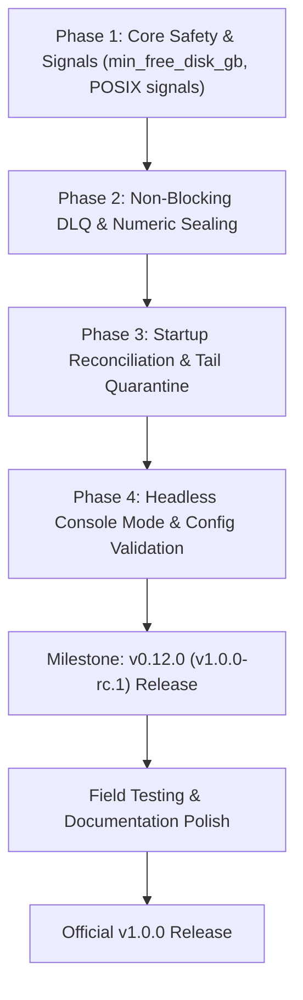

# chzzk-load v1.0.0 Production Readiness Specification & Roadmap

- **Status**: Approved Specification
- **Target Milestones**: `v0.12.0` (Release Candidate / Field Testing) $\to$ `v1.0.0` (Production Release)
- **Author**: Antigravity & User Pair Programming
- **Date**: 2026-10-01

---

## 1. Executive Summary & Objective

`chzzk-load` v0.11.0 provides high-performance HLS recording, real-time chat archiving, stream metadata tracking, and rclone cloud synchronization with near-zero CPU overhead. However, preparing for the official **v1.0.0** stable release requires closing critical operational and reliability gaps identified during codebase audits.

The goal of this specification is **Production Hardening First**: delivering ironclad disk safety, POSIX process lifecycle controls, non-blocking upload retry resilience, crash reconciliation, and headless environment support before declaring v1.0.0.

---

## 2. Gaps Identified in v0.11.0

| Component | Status in v0.11.0 | v1.0.0 Specification |
| :--- | :--- | :--- |
| **Disk Space Guarding** | Placebo configuration `min_free_disk_gb` (unimplemented) | Active disk space inspection; gracefully stops recording to seal & upload chunk before disk runs out |
| **POSIX Signal Handling** | Only `tokio::signal::ctrl_c()` (Windows Ctrl+C / POSIX SIGINT) | Unified listener for `SIGINT`, `SIGTERM` (Docker / systemd), and `SIGHUP` with graceful shutdown & 15s timeout |
| **Upload Failure Handling** | Single attempt, drop on error, stalls chunks on disk | **Non-blocking Dead-Letter Queue (DLQ)** with exponential backoff (2s, 4s, 8s); subsequent chunks proceed without head-of-line blocking |
| **N+1 Segment Boundary Safety** | Relies on naive slice length `chunks.len() - 1` | Explicit numeric sequence parsing (`chunk_%04d.ts`); robust against non-contiguous DLQ chunks |
| **Crash / Reboot Recovery** | Orphaned chunks from prior crashes are ignored | Automatic startup reconciliation: detects and enqueues un-uploaded session chunks to cloud with tail chunk safety |
| **Headless / Service Mode** | Unconditionally enters TUI raw mode; crashes if stdout is not a TTY | Auto-detect non-TTY or `--headless` / `--no-tui` flag; streams formatted text logs to stdout |
| **Config Validation** | Silent parsing; zero checks on nonsensical parameters | Strict semantic startup validation (`chunk_duration >= 10s`, `min_free_disk_gb >= 0.1`, etc.) |

---

## 3. Core Architectural Specifications

### 3.1. Disk Space Guarding & Recording Circuit Breaker (`src/disk.rs`)
- **Inspection Engine**: Cross-platform query on the volume housing `settings.general.recordings_dir`:
  - **Windows**: `windows-sys::Win32::Storage::FileSystem::GetDiskFreeSpaceExW`
  - **Unix (Linux/macOS)**: `libc::statvfs`
- **Safety Policy**:
  - Checked before every polling cycle and on every 1-second segment-seal interval.
  - If available disk space falls below `min_free_disk_gb` (e.g. `2.0 GB`):
    1. **Circuit Breaker Trips**: Active recording sessions are gracefully stopped immediately (`"q\n"` to FFmpeg).
    2. FFmpeg flushes and finalizes the active MPEG-TS container header.
    3. The final chunk is sealed and enqueued for upload to cloud storage, actively reclaiming disk space.
    4. New recording sessions are blocked from spawning while disk space remains below threshold.
    5. A high-priority warning is emitted to logs:
       `[DISK] Disk space critically low ({available:.2} GB < {threshold:.2} GB). Recording paused to prevent disk exhaustion.`
    6. Once uploads complete and free space recovers above `min_free_disk_gb`, polling automatically resumes recording.

### 3.2. Unified POSIX Signal Handling & Shutdown Lifecycle (`src/main.rs`)
- **Signal Coverage**:
  - **Windows**: `tokio::signal::ctrl_c()`
  - **Unix**: `tokio::signal::unix` listening concurrently for `SIGINT` (Ctrl+C), `SIGTERM` (Docker / systemd stop), and `SIGHUP` (terminal closed).
- **Graceful Lifecycle**:
  - **1st Signal**: Sets `cancel_token.cancel()`. Initiates graceful drain:
    - Signals FFmpeg child processes to cleanly terminate via `"q\n"`.
    - Flushes active `ChatWriter` buffers into time-aligned `chat_%04d.jsonl` chunks.
    - Waits for in-flight uploads and enqueued DLQ tasks to drain.
    - Cleans up empty local session directories.
  - **2nd Signal**: Immediate emergency exit. Restores terminal raw mode (`disable_raw_mode()`, `LeaveAlternateScreen`, `Show`) and exits with status `130` (SIGINT) or `143` (SIGTERM).
  - **Safety Timeout**: A background 15-second timer runs during graceful shutdown. If the process does not terminate within 15 seconds, it forcefully restores the terminal and exits, preventing hangs in CI / container orchestrators.

### 3.3. Non-Blocking Dead-Letter Queue (DLQ) Upload Architecture (`src/uploader/worker.rs`)
To maintain the strictly bounded disk footprint without head-of-line blocking:

```
[Sealed Chunks from Watcher]
            │
            ▼
┌─────────────────────────┐
│  Primary Channel Queue  │ ──────► [rclone copyto] ──(Success)──► [Delete Local Chunk]
└─────────────────────────┘                   │
            ▲                                 ▼ (Failure)
            │                    ┌─────────────────────────┐
(Continuous progress:            │ Dead-Letter Queue (DLQ) │
Next chunk N+1 unblocked)        │ (Max 20 chunks in RAM)  │
                                 └─────────────────────────┘
                                              │ (Exponential Backoff: 2s, 4s, 8s)
                                              ▼
                                 [Opportunistic Retry]
                                       │             │
                             (Success) ▼             ▼ (All 3 Retries Exhausted)
                        [Delete Local Chunk]    [Evict from RAM; Preserved on Disk]
```

1. **Primary Queue (Non-Blocking)**:
   - When a chunk upload fails in `upload_file_and_delete`, it is **immediately removed from the primary queue** and transferred to the channel's Dead-Letter Queue.
   - The primary queue immediately proceeds to chunk $N+1$. Subsequent chunks continue uploading and deleting normally, freeing up local disk space.
2. **Background DLQ Worker with Exponential Backoff**:
   - Chunks in the DLQ are retried using exponential backoff:
     - Attempt 1: $+2\text{s}$
     - Attempt 2: $+4\text{s}$
     - Attempt 3: $+8\text{s}$
   - DLQ uploads are processed with lower priority than live chunks to prevent uplink contention.
   - Upon confirmed upload (HTTP 200/201 from rclone), the local chunk is deleted immediately.
3. **Finite In-Memory Lifecycle & State Eviction**:
   - If a chunk exhausts all 3 retries, it is **evicted from active RAM**, ensuring memory consumption remains strictly $O(1)$.
   - A critical alert is logged: `[DLQ] Retries exhausted for {chunk_name}. Preserved on disk for startup reconciliation.`
   - The file remains safely on disk (never deleted without confirmed upload).

### 3.4. N+1 Segment Boundary Safety Invariants
- **Sealing vs. Uploading Decoupling**:
  - The N+1 boundary invariant belongs strictly to `SegmentWatcher`.
  - A chunk $N$ is only emitted as sealed once chunk $N+1$ exists on disk with size $> 0$ (or upon clean stream termination).
  - An upload failure never un-seals a chunk or alters `watcher.already_enqueued`.
- **Explicit Sequence Parsing**:
  - `SegmentWatcher` discards the naive slice heuristic `chunks.len() - 1` and adopts **explicit numeric sequence parsing** (`chunk_%04d.ts`).
  - Chunk $i$ is sealed if and only if:
    $$\exists j > i \quad \text{such that } \text{chunk}_j \text{ exists on disk with } \text{size} > 0$$
  - Non-contiguous files remaining on disk due to DLQ retries cannot falsely alter boundary detection of active chunks.
- **Session Finalization Fence**:
  - The orchestrator will not finalize a session or upload the closing `metadata.jsonl` until all DLQ tasks for that channel are either confirmed uploaded or have exhausted retries.

### 3.5. Resource Management Under Cloud Outages
- **RAM Bounding**:
  - Hard cap of at most 20 DLQ retry tasks per channel in memory.
  - Tasks evict from RAM upon 3rd failure. Total memory overhead during outages remains $< 35\text{ MB}$.
- **Disk Bounding**:
  - Bounded strictly by `min_free_disk_gb`. If prolonged network failure causes chunks to accumulate, the recording circuit breaker halts FFmpeg before the drive fills up.
- **Subprocess Throttle**:
  - If 5 consecutive chunk uploads fail across all channels, a 30-second backoff circuit breaker is tripped.
  - Probes remote health via `backend.check_connection()` before resuming subprocess spawns.

### 3.6. Startup Crash Reconciliation & Tail Chunk Quarantine (`src/engine/dispatcher.rs`)
- On startup, if cloud backend is active (`remote_path != ""`):
  - Scans `recordings_dir` for session folders from prior runs.
  - **Contiguity Check**: For any unfinalized session folder, chunk $i$ is verified sealed only if chunk $i+1$ exists on disk with size $> 0$.
  - **Tail Quarantine**: The highest-numbered chunk in the orphaned folder (which lacks an $N+1$) was actively being written when the crash occurred. It is probed for container integrity (`ffprobe` / header inspection) or quarantined as a partial chunk, preventing corrupted video segments from being uploaded.
  - Valid orphaned chunks are enqueued to `upload_tx` and deleted upon confirmation, reclaiming local disk space.

### 3.7. Headless Console Mode (`--headless` / `--no-tui`) (`src/main.rs`)
- **Flags**: `--headless`, `--no-tui`.
- **Auto-Detection**: If `!std::io::stdout().is_terminal()`, automatically fall back to headless mode.
- **Operation**:
  - Bypasses raw terminal mode, alternate screen, and Ratatui TUI.
  - Formats all `AppEvent::Log` messages to stdout with local timestamps and colorized level badges (`[ERROR]`, `[WARN]`, `[REC]`, `[CHAT]`, `[CLOUD]`, `[INFO]`).
  - Perfect for 24/7 Docker containers, systemd services, or piped logging.

### 3.8. Strict Configuration Semantic Validation (`src/config.rs`)
- `chunk_duration_seconds`: $\ge 10$.
- `poll_interval_seconds`: $\ge 1$.
- `stream_cooldown_seconds`: $\ge 0$.
- `min_free_disk_gb`: $\ge 0.1\text{ GB}$.
- `upload_concurrency`: $\ge 1$.
- Warns prominently if the default unconfigured sample channel ID (`4c3b44869c9b1399723ec28ec236f736`) is present in `settings.toml`.

---

## 4. Implementation Roadmap (v0.12.0 $\to$ v1.0.0)



### Detailed Task Checklists

#### Phase 1: Core Safety & System Signals
- [ ] Implement `src/disk.rs` with cross-platform free disk space inspection (`GetDiskFreeSpaceExW` on Windows, `statvfs` on Unix).
- [ ] Wire disk threshold checks into `EngineOrchestrator::run` and `RecordingSession` watcher loop.
- [ ] Add unified Unix signal listeners (`SIGTERM`, `SIGHUP`) in `src/main.rs` with 15s grace timeout.
- [ ] Add unit tests in `tests/test_disk.rs` and verify disk threshold enforcement.

#### Phase 2: Non-Blocking DLQ & Numeric Sealing
- [ ] Update `SegmentWatcher` in `src/recorder/watcher.rs` to use explicit numeric index parsing (`chunk_%04d.ts`) rather than array-length slicing.
- [ ] Implement Dead-Letter Queue (DLQ) in `src/uploader/worker.rs`:
  - Instant transfer of failed chunks to DLQ; primary queue immediately advances.
  - Background exponential backoff retry loop (2s, 4s, 8s; max 3 attempts).
  - In-memory cap of 20 tasks per channel; RAM eviction on retry exhaustion.
  - Subprocess health circuit breaker after 5 consecutive failures.
- [ ] Add unit tests in `tests/test_upload_worker.rs` verifying non-blocking DLQ behavior, backoff intervals, and continuous primary upload processing.

#### Phase 3: Startup Reconciliation & Tail Quarantine
- [ ] Implement startup reconciliation in `src/engine/reconciliation.rs`:
  - Detect and enqueue orphaned completed chunks from previous sessions.
  - Quarantine/validate unfinalized trailing chunks lacking an $N+1$ counterpart.
- [ ] Add integration tests in `tests/test_engine_reconciliation.rs`.

#### Phase 4: Headless Mode & Config Validation
- [ ] Add `--headless` / `--no-tui` CLI options in `src/main.rs`.
- [ ] Add `std::io::IsTerminal` auto-detection to bypass TUI raw mode when stdout is redirected or non-interactive.
- [ ] Implement `run_headless` loop streaming colorized log events to stdout.
- [ ] Implement `Settings::validate(&self)` in `src/config.rs`.
- [ ] Add CLI smoke tests in `tests/test_cli_smoke.rs`.

#### Phase 5: Verification & Staged Release (v0.12.0)
- [ ] Run full test suite: `cargo test --all-targets`.
- [ ] Run linter: `cargo clippy --all-targets -- -D warnings`.
- [ ] Format check: `cargo fmt --check`.
- [ ] Run npm package test suite: `node scripts/test-npm-packages.js`.
- [ ] Update `README.md`, `README.ko.md`, and `AGENTS.md`.
- [ ] Tag and publish `v0.12.0` (acting as `v1.0.0-rc.1`) for field testing before tagging final `v1.0.0`.
